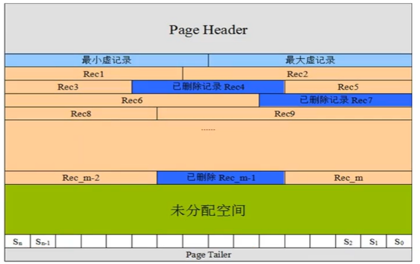
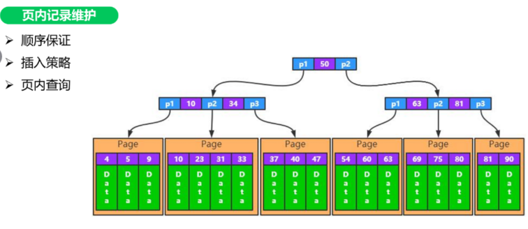
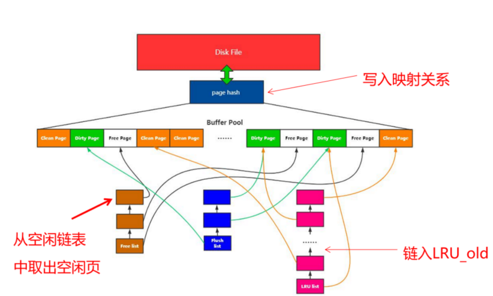
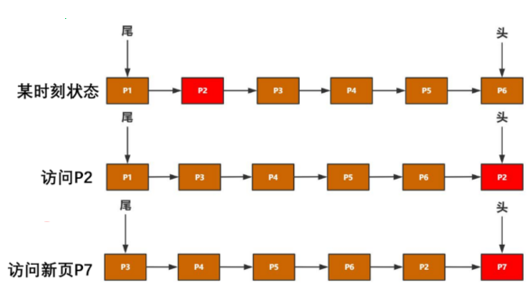

# MySQL


# 页-记录存储




## 页头

* 记录页面的控制信息,共占56个字节,包括页的左右兄弟页面指针,页面空间使用情况等


## 虚记录

* 最大虚记录:比页内最大主键还大,主要是比较主键大小
* 最小虚记录:比页内最小主键还小


## 记录堆

* 行记录存储区,分为有效记录和已删除记录两种


## 自由空间链表

* 已删除记录组成的链表


## 未分配空间

* 页面未使用的存储空间


## Slot

* 每个Slot会指向某个链表的头部,以便于二分查找


## 页尾

* 页面最后部分,占8个字节,主要存储页面的校验信息


# 页内维护记录




## 顺序保证


* 物理有序:类似数组,连续的空间存储数据,有利于读
* 逻辑有序:类似链表,有利于写数据.数据库底层使用逻辑有序


## 插入策略


* 自由空间链表:已删除记录是逻辑删除,物理地址仍然存在,当何时的值进行存储时会填入该处.如果逻辑删除的空间不使用,则数据占用空间越来越大,且很多地方无法使用,浪费空间
* 未使用空间:存储新数据


## 页内查询


* 遍历
* 二分查找


# 数据库引擎

> 主要介绍MyISAM和InnoDB,还有其他类型,用的不多.mysql5.5之前默认是MyISAM,之后是InnoDB

* show engines:查看所有引擎类型
* show variables like '%storage_engine%':查看所有表所用引擎类型


## MyISAM

### 概述

* 不支持外键,不支持事务
* 只能表锁,即使操作一条数据时也会锁住整个表,不适合高并发
* 读写互相阻塞:写入的时候肯定是都阻塞的,读的时候也阻塞写,但不阻塞另外的读
* 只缓存索引,不缓存真实数据
* 读取速度较快,占用资源较少
* 不支持外键约束,但支持全文索引
* 表空间小


### 适用场景

* 适用于不需要事务的生产场景,一般是读数据比较多的应用
* 并发相对较低的业务
* 数据一致性要求不是很高的业务


### 优化

* 设置合适的索引
* 调整速写优先级,根据实际需求确保重要操作更优先执行
* 启用延迟插入改善大批量写入性能,降低写入频率,尽可能多条数据一次性写入
* 尽量顺序操作让insert数据都写入到末尾,减少阻塞
* 分解大的时间长的操作,降低单个操作的阻塞时间
* 降低并发数,减少对Mysql的访问,某些高并发场景通过应用进行排队机制
* 对于相对静态(更改不频繁)的数据库数据,充分利用query cache或redis缓存服务提高访问效率
* MyISAM的count只有在全表扫描到时候效率比较高,带有其他条件的的count都需要进行实际的数据访问


## InnoDB

###  概述

* 支持外键,支持事务,支持多版本读
* 行锁,操作时只锁某一行,不对其他行有影响,适合高并发,通过索引实现.但是全表扫描时仍然会升级成表锁,同时需要注意间隙锁的影响
* 读写阻塞与事务的隔离级别相关
* 不仅缓存索引还缓存真实数据,对内存要求较高,而且内存大小对性能有决定性的影响
* 支持分区和表空间
* 整个表和主键以cluster方式存储,组成一颗平衡树
* 所有secondary index都会保存主键信息


### 适用场景

* 需要事务支持的业务,具有较好的事务特性
* 行级锁定对高并发有很好的适应能力,但需要确保查询是通过索引完成
* 数据读写以及更新比较频繁的场景
* 数据一致性高的业务


### 优化

* 主键尽可能小,避免给secondary index带来过大的空间负担
* 避免全表扫描,会使用表锁
* 尽可能缓存所有的索引和数据,提高响应速度,减少磁盘IO消耗
* 在大批量小插入的时候,尽量自己控制事务而不要使用自动提交
* 合理设置innodb_flush_log_at_trx_commit(日志刷到磁盘上)参数,不要过度追求安全性
* 避免主键更新,因为这会带来大量的数据移动


# InnoDB内存管理

* 页面装载:预分配内存空间,使用内存加载部分数据,存储引擎从内存中查找数据
  * 内存池

* 数据以页为单位加载
  * 页面动态映射
  * 页面数据管理
    * 空闲页:没有数据的页
    * 数据页:写入了数据的页,和磁盘上的数据一致,也称为干净页
    * 脏页:页上的数据和磁盘上的数据不一致

* 数据淘汰
  * 内存页都被使用
  * 需要加载新数据
* 数据内外存交换:磁盘和内存中数据的交互


## 组成


* Disk File:磁盘
* Page Hash表:维护内存Page和磁盘文件Page的映射关系
* Buffer Pool:预分配的内存池
* Page:Buffer Pool的最小单位
* Free List:空闲Page组成的链表,即还没有使用的空间
* Flush List:脏页组成的链表
* LRU:内存淘汰算法


## 页面装载



* 主要是将磁盘数据加载到内存中
* 先从空闲链表中取出空闲页,将数据写入到空闲页中,使该空闲页变为数据页
* 如果空闲页链表中没有空闲页,则使用LRU算法淘汰数据页
* 从LRU_OLD尾部往前查找.如果尾部正在使用,不能淘汰,则往前找到脏页进行淘汰
  * Free List中取页->LRU中淘汰冷表尾部数据->LRU Flush
* 将当前数据页从空闲页链表中剔除,插入到冷链表中
* 将映射磁盘内存映射关系写入Page Hash


## 页面淘汰



* 如上图所示,在热点链表中,每次访问的新数据都会被移动到链表头部,新页也会被加载到头部


### LRU


* LRU:最久没有使用的页被淘汰,同时将最近访问的数据放到表头
* LRU_NEW:热点数据链表
* LRU_OLD:冷数据链表
* MidPoint:区分冷表,热表数据,是一个指针.默认冷热占比为3:5,而MidPoint只指向5/8处
* LRU尾部淘汰:默认从冷表尾部进行淘汰
* Flush LRU淘汰:LRU冷表中尾部数据无法释放,则将第一个脏页刷盘并释放.先将页数据写到磁盘上,再释放页,将页放到Free List中.写完新数据后再将数据页放到冷表头部

* 全表扫描:会将表中数据全部加载到内存中,造成内存污染,将原来的热点数据淘汰
* 如何避免热数据被淘汰
  * 访问时间+频率
  * 建立2个LRU表:一个热数据表,一个冷数据表.当数据频率发生变化时,可以将2个表的数据交互


### 冷链表到热链表

* innodb_old_blocks_time:old区存活时间,大于该值,则数据页**有机会**进入热链表,默认1S


### 热链表到冷链表

* MidPoint默认是指向5/8处,当数据页从冷表到热表时,直接移动MidPoint到5/8即可


### 热链表内移动

* 将最近发访问的数据移动到表头,这会加重系统开销.同时,在高并发下,还会有加锁的问题
* 处理方法是减少移动次数,有以下几个指标:
  * freed_page_clock:Buffer Pool全局淘汰页数,发生一次就加一
  * `当前freed_page_clock-上次移动到Header时freed_page_clock>LRU_NEW长度1/4`时进行移动


# 基础语法

## 特殊语法

* mysql中使用了关键字,需要用``(反引号)包裹起来

* mysql  -uroot -p123456 -e "show databases;":-e参数可以直接在非mysql环境中执行sql语句

* system ls /:在mysql中使用system加上linux命令,可以查看linux系统的文件

* mysqlbinlog:可以查看bin-log日志里的内容

* 命令行内的语句结束符可以为;(分号),此时输出为横排结果.若末尾是\G,不是分号,则是竖排结果

* delimiter:修改当前对话的语句结束符

* SQL对大小写不敏感

* +:mysql中+号只能用来做运算,拼接字符串要用concat

  * +两边是数字,直接做运算

  * 两边的不是数字,先尝试转成数字,该处有2种情况

  * 若A以字符串开头,则将整个字符串转换为0进行运算

    ```mysql
    select 'fdfd34'+4; # 4
    ```

  * 若A是以数字开头的字符串,那么将会把从开头到第一个字符换之间的数字转化之后做运算

    ```mysql
    select '234f'+4; # 238
    select '5fdfd34'+4; # 9 
    ```

  * 若一边为null,则结果null

* Mysql中截取函数的下标从1开始,并不是从0开始,含头不含尾

* LOCK TABLES table:锁定表

* UNLOCK TABLES:解锁所有表


## 系统语法

* SHOW DATABASES:查看所有的数据库
* USE dbname:使用名称为dbname数据库
* SHOW TABLES FOR dbname:直接查看dbname数据库中的所有表
* SHOW TABLES:必须先使用use dbname之后才可以使用,查看当前数据库中所有表
* SHOW TABLE STATUS:查看表状态
* SHOW CREATE TABLE tablename:查看表结构,信息更详细
* DESC tablename/DESCRIBE tablename/EXPLAIN tablename/SHOW COLUMNS FROM tablename:查看表结构,分析表结构,展示表字段
* RENAME TABLE old_tablename TO new_tablename:修改表名
* RENAME TABLE old_tablename TO dbname.tablename:将表移动到另外一个库并重新命名
* ALTER TABLE table []:修改表结构

  * ADD COLUMN col property []:新增字段col,以及其他属性,如类型,长度等
    * AFTER col1:新增在某个已有的字段后
    * FIRST:新增为第一个字段

  * ADD PRIMARY KEY(col):将col字段设置为主键
  * DROP PRIMARY KEY:删除主键,需要先删除AUTO_INCREMENT属性
  * ADD UNIQUE [indexname]  (col):将某字段设置为唯一索引,可自定义索引名
  * ADD INDEX [indexname]  (col):创建普通索引,可自定义索引名
  * DROP INDEX indexname:删除索引
  * DROP COLUMN col:删除字段
  * MODIFY COLUMN col property:修改字段属性,不可修改字段名,所有原有属性也都必须写上
  * CHANGE COLUMN old_col new_col property:同modify,但可修改字段名
  * ADD CONSTRAINT foreignname FOREIGN KEY(col) REFERENCES table1(col1):将table的col字段外键关联到table1的col1字段,table1为主表
  * DROP FOREIGN KEY foreignname:删除外键
* TRUNCATE TABLE table:直接删除表之后再重新建表结构,数据不可恢复
* CREATE TABLE table LIKE table1:复制表table的表结构到table1
* CREATE TABLE table AS SELECT * FROM table1:复制tablename1的表结构和数据到table


# 常用函数


## 通用函数

* SELECT database(),now(),user(),version():查看mysql当前数据库,时间,登录用户,版本号
* IFNULL(exp1,exp2):若exp1表达式为null,则使用exp2的值,若不为null,则使用exp1的值
* MD5(str):对字符串加密,只用在新增mysql用户的时候
* LOAD_FILE(file_name):从文件读取内容
* GROUP_CONCAT():


## 字符串函数

* CONCAT(str1,str2...):直接将字符串拼接

* CONCAT_WS(sperate,str1,str2...):将字符串按照指定的分隔符sperate拼接

* LENGTH(str):str的**字节**长度,需要根据编码来测算

* CHAR_LENGTH(str):str的字符个数

* UPPER(str):将str字符串全部转换为大写

* UCASE(str):将str全部转换成大写

* LOWER(str):将str字符串全部转换为小写

* LCASE(str):将str全部转换成小写

* SUBSTR/SUBSTRING(str, position [,length]):从str的position开始截取length个字符串,若length不存在,截取到末尾.当position为正数,从开始向末尾读position个下标.若position为负数,从末尾开始向开头读取position,同样是向末尾截取.**注意,mysql中字符串下标从1开始,含头不含尾**

  ```mysql
  substr('sfewrew',5); # rew
  substr('sioioplb,-5); # ioplb
  ```

* LEFT(str,length):从str开头向末尾截取length个字符.若str长度不够,返回str.若length为负数,返回空字符串

* RIGHT(str,length):从str末尾起开头截取length个字符.若str长度不够,返回str.若length为负数,返回空字符串

* INSTR(str,str1):从str中查找str1的第一次出现的下标,找不到返回0

  ```mysql
  substr('sfewrew','ew'); # 3
  ```

* LOCATE(str, str1[,start_position]):同instr,但可指定开始位置

* TRIM([str FROM] str1):去除str1两边的空白字符串,中间的不去除.str表示去除指定字符串

* LTRIM(str):去除前端空白字符串

* RTRIM(str):去除后端空白字符串

* REPEAT(str, count):将str重复count次拼接起来

* LPAD(str, length, pad):从str开头截取length个字符串.若str长度不够,则左边补充pad,直到长度达到length

* RPAD(str, length, pad):从str开头截取length个字符串.若str长度不够,则右边补充pad,直到长度达到length

* REPLACE(str ,search_str ,replace_str):在str中用replace_str替换所有的search_str

* CHARSET(str):返回字串字符集


## 数学函数

* ABS(x):返回x的绝对值

* FORMAT(x, d):格式化千分位数值

  ```mysql
  select format(1234567.456, 2) # 1,234,567.46
  ```

* CEIL(x):向上取整,返回大于等于x的最小整数

  ```mysql
  select ceil(10.1); # 11
  select ceil(-10.1); # -10
  ```

* FLOOR(x):向下取整,返回小于等于x的最大整数

* ROUND(x[,precise]):四舍五入,默认取整.precise,保留几位小数

* TRUNCATE(x, d):x截取d位小数,并不进行四舍五入.若小数位不够,返回x

* MOD(m, n):等同于m%n, m mod n,求余.10%3=1

* PI():返回6位小数的圆周率

* POW(m, n):返回m的n次方

* SQRT(x):算术平方根

* RAND():随机数


## 时间函数

```mysql
# %Y:4位年
# %y:2位年
# %m:2位月
# %c:1位或2位月
# %d:2位月中日
# %H:24小时制
# %h:12小时制
# %i:2位分钟
# %s:2位秒
```

* NOW(), CURRENT_TIMESTAMP():当前日期时间

* CURDATE()/CURRENT_DATE():返回当前日期

* CURTIME()/CURRENT_TIME():返回当前时间

* DATE('yyyy-mm-dd hh:ii:ss'):获取日期部分

* TIME('yyyy-mm-dd hh:ii:ss'):获取时间部分

* DATE_FORMAT(date/datestr,format):将日期或时间字符串格式化为指定格式字符串

  ```mysql
  select date_format(now(),'%y-%c-%d'); # 20-1-01
  select date_format('2020-01-01','%y-%c-%d'); # 20-1-01
  select date_format('20-01-01','%y-%c-%d'); # 20-1-01
  select date_format('20-01-01','%Y-%c-%d'); # 2020-1-01
  select date_format('2020-01-01','%Y-%m-%d'); # 2020-01-01
  ```

* STR_TO_DATE(datestr,format):将日期格式的字符串转换为指定格式的日期,年月日必须一起,时分秒必须一起.在转换时,不要用%y,%c,可能会出现预期之外的结果.尽量使用date_format

  ```mysql
  select str_to_date('2020-01-01','%Y-%m-%d'); # 2020-01-01
  select str_to_date('2020-01-01','%y-%m-%d'); # NULL,不知道是什么逻辑
  select str_to_date('20-01-01','%y-%m-%d'); # 2020-01-01,不知道是什么逻辑
  select str_to_date('20-01-01','%y-%c-%d'); # 2020-01-01,不知道是什么逻辑
  select str_to_date('2020-1-01','%Y-%c-%d'); # 2020-01-01,不知道是什么逻辑,%c无效
  select str_to_date('2020-01-01','%Y-%c-%d'); # 2020-01-01,不知道是什么逻辑,%c无效
  select str_to_date('2020-1-01','%y-%c-%d'); # NULL,不知道是什么逻辑,%y,%c无效
  select str_to_date('2020-01-01','%y-%c-%d'); # NULL,不知道是什么逻辑,%y,%c无效
  ```

* UNIX_TIMESTAMP():获得unix时间戳

* FROM_UNIXTIME():从时间戳获得时间

* YEAR/MONTH/DAY(NOW()/'yyyy-mm-dd hh:ii:ss'):获得指定时间的4位年部分,1或2位月,1或2位月中天

* MONTHNAME(NOW()):获得指定时间的月份英文


## 流程控制函数

### IF

```mysql
# 第一种形式,只有2种结果
IF(cnd,res1,res2) # 当cnd条件的结果为true,返回结果res1,false返回res2
# 第二种形式,有多种结果
IF cnd1 THEN 
	res1
ELSEIF cnd2 THEN
	res2
ELSE
	res3
END IF
```


### CASE WHEN

```mysql
# 第一种形式,该方式适用于等值比较
CASE column # column可以是字段,也可以某个表达式
WHEN cnd1 THEN res1 # cnd1是column的可能值或者是某种判断,res1是满足cnd1之后返回的值
[WHEN cnd2 THEN res] # 另外的分支结果,可以有多个,cnd2是另外的值或判断,满足cnd2则返回res2
[ELSE res3] # 默认值,可有可无
END
# 第二种形式,该方式既适用于等值比较,也适用于范围值比较,如<,>
CASE WHTN cnd1 THEN res1 # cnd1直接是一个条件,若满足该条件,则返回res1
[WHEN cnd2 THEN res2] # 满足cnd2则返回res2
[ELSE res3] # 返回默认值
END
```


### WHILE

```mysql
[label:]WHILE cnd1 DO # label可有无,主要是用来跳出循环时使用.cnd1为循环的条件
	sql;	# 需要执行的sql
END WHILE[label]
```

* 如果需要在循环内提前终止while循环,则需要使用标签,标签需要成对出现
* 退出循环,通过退出的标签决定退出哪个循环
  * leave label:退出整个循环
  * iterate label:退出当前循环


### REPEAT

```mysql
[label:]REPEAT  # label可有无,主要是用来跳出循环时使用
	sql;
UNTIL cnd1 # cnd1为结束循环的条件
END REPEAT[label]
```

* 如果需要在循环内提前终止REPEAT循环,则需要使用标签,标签需要成对出现
* 退出循环,通过退出的标签决定退出哪个循环
  * leave label:退出整个循环
  * iterate label:退出当前循环


# 自定义变量

* 自定义变量只在当前会话有效,只能在定义了之后使用
* SET/SELECT @var_name=value:声明一个变量并给变量赋值
* SELECT column INTO @var_name from ...:利用sql语句给变量赋值,sql只能返回一个值,但是可以同时给多个变量赋值
* SELECT @var_name:查看自定义变量的值


# 局部变量

* BEGIN...END:语句块,可以在其中写多条语句,一般用于逻辑比较复杂的存储过程等
* DECLARE @var_name[,...] type [default]:声明局部变量,初始化值可以是常数或表达式,不赋值则为null.
* 局部变量必须先声明,之后才可以用自定义变量赋值的方式进行赋值
* 局部变量只能在begin...end中使用,且必须是第一句话


# 触发器

* TRIGGER:触发器,主要是监听表中记录的增删改
* CREATE TRIGGER triggername triggertime triggerevent ON tablename FOR EACH ROW trigger_sql
  * triggertime:触发程序的时间,可以是before或after,以指明触发程序是在激活它的语句之前或之后触发
  * triggerevent:指明激活触发程序的语句类型,可以是INSERT,DELETE,UPDATE
  * tablename:必须是永久表,不可以是临时表
  * trigger_sql:激活触发程序之后执行的语句,多个语句可以用begin...end
* DROP TRIGGER triggername:删除触发器


# 方法

* CREATE FUNCTION func_name(参数列表) RETURNS 返回值类型 BEGIN ...sql逻辑... END:创建一个方法,必须有且仅有一个返回值

* 参数列表:变量名称 类型(长度),多个用逗号隔开

* SELECT func_name(参数列表):调用方法

  ```mysql
  CREATE FUNCTION func_name(userId int) RETURNS VARCHAR 
  BEGIN
  	DECLARE @result VARCHAR(50);
  	SELECT username into @result from ts_user where id=userId;
  	RETURN @result;
  END
  SELECT func_name(1);
  ```

* DROP FUNCTION [IF EXISTS] function_name:删除方法

* SHOW FUNCTION STATUS LIKE 'partten'/SHOW CREATE FUNCTION function_name:显示方法

* ALTER FUNCTION function_name 函数选项:修改方法


# 存储过程

* CREATE PROCEDURE sp_name (参数列表) BEGIN ...sql逻辑... END:创建存储过程

  * 参数列表:不同于函数的参数列表,需要指明参数类型
    * IN:表示输入型,需要调用的时候传入
    * OUT:表示输出型,将过程体处理完的结果返回到客户端.存储过程体中不需要加return语句
    * INOUT:表示混合型,输入和输出都可以

* CALL sp_name(参数列表):调用存储过程.只能单独调用,不可夹杂在其他语句中

  ```mysql
  CREATE PROCEDURE sp_name(IN userId INT,OUT username VARCHAR(50))
  BEGIN
  	SELECT username into username from ts_user where id=userId;
  END
  CALL sp_name(1,@username); # @username是定义的一个变量
  ```

* DROP PROCEDURE sp_name:删除存储过程

* SHOW CREATE PROCEDURE sp_name:查看存储过程的定义


# 表检查

## 检查表错误

```mysql
CHECK TABLE tablename1,tablename2... [option]
# option = {QUICK | FAST | MEDIUM | EXTENDED | CHANGED}
```


## 优化表,整理数据文件碎片

```mysql
OPTIMIZE [LOCAL|NO_WRITE_TO_BINLOG] TABLE tablename1,tablename2...
```


## 修复表

```mysql
REPAIR [LOCAL|NO_WRITE_TO_BINLOG] TABLE tablename1,tablename2... [QUICK,EXTENDED,USE_FRM]
```


## 分析表和存储表的关键字分布

```mysql
ANALYZE [LOCAL|NO_WRITE_TO_BINLOG] TABLE tablename1,tablename2
```


## 分析sql语句

```mysql
EXPLAIN select ... # explain后接sql语句
```


# 硬件优化


* 数据库主机的IO性能是需要最优先考虑的因素,适当增大IO数
* CPU处理能力需求更大
* 网络设备性能要好
* 打开tcp连接数的限制,打开文件数的限制,安全性的限制


# EXPLAIN

* explain可以分析sql的表读取顺序,数据读取操作的操作类型,那些索引可以使用,那些索引被实际使用,表之间的引用,每张表有多少行被优化器查询

* explain sql:直接在sql前面加上explain即可

* explain内容:id,select_type,table,type,possible_keys,key,key_len,ref,rows,extra

  

## ID

* select查询的序列号,包含一组数字,表示查询中执行select子句或操作表的顺序

* id相同:table加载的顺序由上而下
* id不同:如果是子查询,id的序号会递增,id越大优先级越高,越先被执行.一般是先执行子句
* id不同和相同同时存在:先加载数字大的,数字相同的顺序执行.若table行内出现衍生表(derived+id),衍生表后的数字是id的值,表示该验证表是由那一个id衍生而来
* id为null,表示这是一个结果集,不需要进行查询

```mysql
# id相同,此时id是相同的,都为1,而表加载顺序是t1->t3->t2
explain select * from t1,t2,t3 where t1.id =t2.id and t2.id = t3.id;
# id不同,此时id递增,1,2,3,而表加载顺序是t3->t1->t2
explain select * from t2 where id=(select id from t1 where id = (select t3.id from t3 where t3.name=''));
# id相同和不同同时存在,数字大的先加载,相同的顺序执行,加载顺序为t3->t2
explan select * from (select t3.id from t3 where t3.name='') s1,t2 where s1.id=t2.id
```


## Select_type

* 查询类型,在版本8和版本5中可能出现的情况不一样

* simple:简单select查询,查询中不包含子查询或union.有连接查询时,外层查询为simple,且只有一个
* primary:查询中若包含任何子查询或union,最外层查询将会认为是primary,且只有一个
* subquery:除了from子句中包含的子查询外,其他地方的子查询都可能是subquery
* dependent subquery:表示当前subquery的查询结果会受到外部表查询的影响
* derived:在from列表中包含的子查询被标记为DERIVED(衍生),mysql会递归执行这些子查询,把结果放在临时表中
* union:union连接的2个查询.除第一个查询是derived之外,之后的表都是union;若union包含在from子句的子查询中,外层select将被标记为derived
* union result:在union表获取结果的select,不需要参与查询,所以id为null
* dependent union:与union一样,出现在union中,但是会受到外部查询的影响
* materialized:物化通过将子查询结果作为一个临时表来加快查询速度,正常来说是常驻内存,下次查询会再次引用临时表.通常情况下是作为子查询的大表第一次被查询之后,结果将会被存储在内存中,下次再试用该大表查询时就能直接从内存中读取


## Table

* 显示查询表名,也可能是表别名.如果不涉及数据操作,就显示null
* <subqueryN>:表示这个是子查询.N就是执行计划的id,表示结果来自于该子查询id
* <derivedN>:表示这个是临时表.N就是执行计划中的id,表示结果来自于该查询id
* <union M,N>:与derived类型,表示结果来自于union查询的id为M,N的结果集


## Prititions

* 查询涉及到的分区


## Type

* 表示查询的数据使用了何种类型,从好到坏:system>const>eq_ref>ref>range>index>all
* 一般来说,得保证查询至少达到range级别,最好能达到ref

* system:表只有一行记录(等于系统表),这是const类型的特例,一般不会出现,可以忽略.而且只能用于myisam和memory表,如果是innodb表,通常显示all或index

* const:表示通过索引或主键一次就找到了,const用于比较主键或者unique索引.因为只匹配一行数据,所以很快.如将主键置于where子句中,mysql就能将该查询转换为一个常量

* eq_ref:主键和唯一索引扫描.出现在要连接多个表的查询中,驱动表循环获取数据,这行数据的连接条件是第二个表的主键或唯一索引,作为条件查询只返回一条数据,且必须是not null.唯一索引和主键是多列时,只有所有列都用作比较时才会出现eq_ref

* ref:非唯一性索引扫描,返回匹配某个单独值的所有行,属于查找和扫描的混合体,但本质上也是一种索引访问.和eq_ref不同,ref不要求连接顺序,也不一定需要唯一索引和主键,只要使用等值查找或多列主键,唯一索引中,使用第一个列之外的列作为等值查找也会出现

* fulltext:全文索引检索,优先级很高.若全文索引和普通索引同时存在时,优先使用全文索引.只能在创建了全文索引(fulltext)的表中,才可以使用match和against函数

* ref_or_null:与ref类似,只是增加了null值的比较,实际用的不多

* unique_subquery:用户where中的in子查询,子查询返回不重复唯一值

* index_subquery:用户in子查询使用了辅助索引或in常数列表,子查询可能返回重复值

* range:只检索给定范围的行,使用一个索引来选择行,key列显示使用了那个索引

  * 一般是where语句中出现了between,<,>,in等查询时会出现range
  * 这种范围索引扫描比全表扫描要好,因为它只需要开始于索引的某一点,而结束于另一点,不用扫描全部索引
  * range会让复合索引在排序时失效:当range类型用于复合索引的中间时,即使where子句中的字段和顺序都符合复合索引,同时排序,仍然用不上索引

  ```mysql
  # col1,col2,col3为复合索引
  # 此时虽然用上了索引,但是在排序时因为col2为range模式,使得排序的col3使用了using filesort
  explain select * from t1 where t1.col1=1 and t1.col2>1 order by t1.col3;
  # 解决办法:将col2从索引中剔除或直接建立col1和col3的独立索引
  ```

* index:扫描索引,比all快一点,因为索引文件通常比较小

* all:扫描全表数据,效率最低


## Possible_keys

* 显示可能应用在这张表中的索引,一个或多个
* 查询涉及到的字段上若存在索引,则该索引将被列出,但不一定被查询使用
* 和key一起判断是否使用了索引,索引是否失效.多个索引竞争下,到底用了那一个索引


## Key

* 实际使用的索引,null表示没有使用.若查询中使用了覆盖索引,则该索引仅出现在key列表中


## Key_len

* 表示索引中使用的字节数,可通过该列计算查询中使用的索引长度
* 在不损失精确性的情况下,长度越短越好
* key_len显示的值为索引字段的最大可能长度,并非实际使用长度
* 多列索引时,索引可能不会全部使用,需要手动计算使用了那些索引
* 只会计算where条件中使用的索引,排序分组使用的索引不会计算进去


## Ref

* 显示索引使用了那些列或常量被用于查找索引列上的值
  * const:表示使用的是一个常量
  * db.table.column:表示使用的是某个数据库的某张表的某个字段
  * null:没有使用索引
* 如果连接查询时,被驱动表的执行计划显示的是驱动表的关联字段
* 如果是条件使用了表达式,函数或条件列发生了内部隐式转换,可能显示为func


## Rows

* 根据表统计信息以及索引选用情况,大致估算出找到所需记录要读取的行数


## Extra

* 包含不适合在其他列显示但十分重要的额外信息

* Using filesort:该类型需要避免出现.文件内排序,MySQL中无法利用索引完成的排序操作称为文件排序,相当于排序字段并非索引字段.此时MySQL会对数据使用外部索引排序,而不是按照表内的索引顺序进行读取行.当索引字段为复合索引时,where里使用了索引字段,且是按照复合索引的顺序使用,那么排序所使用的字段若不符合复合索引的顺序,也将不使用索引

  ```mysql
  # col1,col2,col3为复合索引
  # col3将无法使用索引进行排序,此时会出现using filesort的内排序
  select * from t1 where col1='' order by col3;
  # 此时仍然使用的是索引排序,而不会出现using filesort,性能更好
  select * from t1 where col1='' order by col2,col3;
  # 此时虽然复合索引中间出现了其他的字段,但仍然会使用索引排序,而不会出现using filesort
  select * from t1 where col1='' and col4='' order by col2,col3;
  ```

* Using temporary:该类型需要避免出现.新建了一个内部临时表,保存中间结果.mysql对结果进行排序时使用临时表.该种情况多出现于复合索引的时候使用group by和order by

  ```mysql
  # col1,col2为复合索引
  # col2将无法使用索引进行排序,此时会出现using temporary,using filesort
  explain select * from t1 where col1 in('','') group by col2;
  # 此时仍然使用的是索引排序,而不会出现using temporary,using filesort,性能更好
  explain select * from t1 where col1 in('','') group by col1,col2;
  ```

* Using index:表示相应的select操作中使用了覆盖索引(Covering Index),避免访问了表的数据,效率还行

  ```mysql
  # col1,col2为复合索引
  # 此时会用到using where和using index
  explain select col2 from t1 where col1 ='';
  # 只用到了using index
  explain select col1,col2 from t1;
  ```

  * 如果同时出现using where,表明索引被用来执行索引键值的查找
  * 如果没有同时出现using where,表明索引用来读取数据而非执行查找动作.

* Using where:用到了where条件,但未使用索引

* Using where Using index:查询的列被索引覆盖,并且where筛选条件是索引列之一但是不是索引的前导列,意味着不能直接通过索引查找符合条件的数据.多出现于复合索引中,被查询字段非复合索引的第一个字段,而是其他字段

* Using index condition:与Using where类似,查询的列不完全被索引覆盖,where条件中是一个前导列的索引,即查询的字段中包含了非索引中的字段

* Using join buffer:表示使用了连接缓存,可以调整join buffer来调优

* impossible where:where子句的值总是false,不能用来获取任何元组

* select tables optimized away:在没有group by子句的情况下,基于索引优化MIN/MAX操作或者对于MyISAM存储引擎优化count(*)操作,补习等到执行阶段再进行计算,查询执行计划生成的的阶段即完成优化

* distinct:优化distinct操作,在找到第一行匹配的元组后即停止找同样值的动作

* no tables used:不带from子句的查询或from dual查询

* null:查询的列未被索引覆盖,并且where筛选条件是索引的前导列,意味着用到了索引

* Using intersect:表示使用and连接各个索引条件时,从处理结果获取交集

* Using union:表示使用or连接各个使用索引的条件时,从处理结果获得并集,只有一个or

* Using sort_union,Using sort_intersect:用and和or查询信息量大时,先查询主键,然后排序合并后返回结果集


## Filtered

* 表示存储引擎返回的数据在srever层过来后,剩下多少满足查询的记录数量的比例
* 是百分比,不是具体记录数


# SQL优化


## SQL执行顺序

```mysql
select distinct(t1.c) c,sum(t1.c) num from t1 inner join t2 on t1.a=t2.a where t1.a = t2.a group by t1.c having num > 0 order by t1.a limit 10 # 一个sql例子
```

* from:先从from语句开始读,多表会形成笛卡尔积
* on:主表数据保留
  * inner join:2张表都有的数据才会保留到下一步
  * left join:2张表中left左边表的数据都会保留,右边表没的数据以null代替
  * right join:2张表中right右边表的数据都会保留,左边表没有的数据以null代替
* where:非聚合,非select别名的条件筛选
* group by:分组
* having:对分组后的数据进行再次筛选
* select:查询出所需要的字段.如果进行了聚合,那么只能查询进行聚合的字段
* order by:排序
* limit:分页


## 优化

* 查询不要使用select *,查询字段也是开销,使用具体的字段代替
* 如exist和in,in和not in,like,索引的使用,关联太多join.可使用explain sql来分析
* 不要在where子句中使用!=,<>,is null,is not null这种条件将跳过索引,直接使用全表扫描
* 不要在where中使用or,会导致索引失效
* 尽量去除表连接操作
* 尽可能在索引中完成排序
* 小结果集驱动大结果集
* 试用mysqldumpshow查看慢日志,优化慢SQL
* 利用第三方工具pt-query-digest查找慢SQL


# 索引优化


## 概述

* 索引也是一张表,该表保存了主键与索引字段,并指向实体表的记录,所以索引是要占空间的

* 索引大大提高了查询速度,但是会降低增删改的速度,因为要同时对表和索引都做操作

* 查询数据在总数据的7%-15%之间加索引效果最好.若查询数据超过20%,相当于全表扫描

* 字段多适用数值,字段长度多使用定长

* 冷热隔离,即使用频率高的字段放一张表,使用频率低的放另外表,如实时和历史数据

* 索引在新增数据时也会消耗大量资源,一个表中的索引最多不要超过6个

* 索引一般也很大,不可能全部都存在内存中,因为索引往往都以索引文件的形式存储在磁盘上

* where子句中多个索引同时只能用一个

* 索引字段的值必须和数据库定义类型相同,若是数据库自动进行类型转换,那么索引将不生效

  ```mysql
  # col1=varchar,col2=varchar,col1和col2为复合索引
  explain select * from test where col1='1' order by col2; # 索引生效
  explain select * from test where col1=1 order by col2; # 索引不生效
  ```

  


## 索引类型


### 聚簇索引

* 是物理索引,数据表就是按顺序存储的,物理上是连续的
  * 如果表中定义了主键,MySQL将使用主键作为聚簇索引
  * 如果表中不指定主键,MySQL将第一个组成列的not null的唯一索引作为聚簇索引
  * 如果表中没有主键且没有适合的唯一索引,MySQL将自动创建一个名为GEN_CLUST_INDEX的隐藏聚簇索引
* 一旦创建了聚簇索引,表中的所有列都根据构造聚簇索引的关键列来存储
* 因为聚簇索引是按该列的排序存储的,因此一个表只能有一个聚簇索引
* 每个InnoDB表都需要一个聚簇索引,该聚簇索引可以帮助表优化增删改查操作
* 在InnDB存储引擎中,每个辅助索引的每条记录都包含主键,也包含非聚簇索引指定的列.MySQL使用辅助索引的主键值来检索聚簇索引,因此应该尽可能将主键缩短,否则辅助索引占用空间会更大
* 逻辑上聚簇索引是主键和数据存在一起,而辅助索引是辅助索引列数据值和主键索引值列存一起


### 二级索引

* 所有不是聚簇索引的索引都叫非聚簇索引或辅助索引或二级索引
* 二级索引的叶子节点中存储的是主键值,通过主键值查找主键索引再找到数据,又叫回表

* 单列索引:即一个索引只包含单个列,一个表可以有多单列索引

* 唯一索引:索引列的值必须唯一,但允许有空值

* 复合索引:一个索引包含多个列,最左匹配,按第一列排序,第一列相同则按第二列排序,依次类推.如果不是按最左开始查找,则无法使用索引.不能跳过中间列;某些列使用范围查询,后面的列不能使用索引;非范围查找的字段在`where`中的位置可以随意,不必按照索引顺序,但最左原则仍存在

* 覆盖索引:该索引类型并不是一个实际存在的,只是一个特殊情况.当select查询的字段是单索引字段或与复合索引的字段的个数,顺序相同时,即使是全表扫描的情况下,仍然会使用索引

* 基本语法:

  ```mysql
  # 创建主键/唯一/全文/普通索引
  CREATE [PRIMARY KEY]/[UNIQUE]/[FULLTEXT]/[INDEX] indexname ON tablename(columnname(length));
  # 新增索引
  ALTER TABLE tablename ADD [PRIMARY KEY]/[UNIQUE]/[FULLTEXT]/[INDEX] indexname[ON](columnname(length));
  # 删除表中所有/单个索引
  DROP INDEX [indexname] ON tablename
  # 查看索引,\G表示竖排显示
  SHOW INDEX FROM tablename\G
  ```

  

## 回表

* 假如普通索引INDEX1为非唯一索引,要查询age=10的数据,需要先在INDEX1索引查找age=10
* 根据age=10的辅助索引上得到主键索引的值为30
* 然后再到主键索引树查找值为30对应的记录R
* 然后INDEX1索引树继续向右查找,发现下一个是age=5不满足条件(非唯一索引后面有可能有相等的值,因此向右查找到第一个不等于3的地方),停止搜索
* 整个过程从INDEX1索引树到主键索引树的过程叫做回表


## 存储空间

* 索引key的大小,页内节点个数,树的层级决定索引文件大小
* 一页的大小为16KB,一个BIGINT主键类型是8个字节,下一层指针是8个字节,即一页可以存1K的索引,3层就是1K+1K\*1K+1K\*1K\*1K,大概是10E数据.如果是32字节的主键长度,可以存6400W


## 主键选择

* 自增主键:顺序写入,效率高.写入磁盘利用率高,每次查询走两级索引
* 随机主键:节点分裂,数据移动.写入磁盘利用率低,每次查询走两级索引
* 业务主键:写入,查询磁盘利用率高,可以使用一级索引
* 复合索引:影响索引大小,不易维护,不建议使用


## 索引结构

* hash:key-value,检索效率远高于B+tree,可以一次定位.因为是散列结构,不能排序
* fulltext:目前仅char,varchar,text3种类型可以
* B+tree:二叉树的变种,每一个结点有多个数据,可以进行指定.子节点可以是多个,当该节点存放的数据个数超过指定的数据个数,就分裂出另外的同层子节点.当子节点超过一定数量时,向下分裂子节点
* B-Tree


* B+Tree


## 索引失效

* LIKE前后使用%->使用覆盖索引
* OR->使用UNION或UNION ALL或使用INDEX MERGE技术,对同一个表使用多个索引分别扫描
* 隐式类型转换->使用精准的数据类型
* 索引列包含计算
* 数据范围影响:索引区分度过低,条件超出索引范围


## 适合创建索引

* 主键自动创建索引,外键应当有索引
* 频繁用来查询的字段创建索引
* 和其他表关联的字段创建索引
* 查询中用来排序的字段可用来创建索引
* 用来分组和统计的字段可创建索引
* 数据量超过 300 的表应该有索引
* 索引应该建在选择性高的字段上
* 索引应该建在小字段上,对于大的文本字段甚至超长字段,不要建索引
* 复合索引的建立需要进行仔细分析,尽量考虑用单字段索引代替
* 复合索引的几个字段经常同时以AND方式出现在WHERE子句中,单字段查询极少甚至没有,则可以建立复合索引,否则考虑单字段索引
* 如果复合索引中包含的字段经常单独出现在WHERE子句中,则分解为多个单字段索引
* 如果复合索引所包含的字段超过 3 个,那么仔细考虑其必要性,考虑减少复合的字段
* 如果既有单字段索引,又有这几个字段上的复合索引,一般可以删除复合索引
* 频繁进行数据操作的表,不要建立太多的索引
* 删除无用的索引,避免对执行计划造成负面影响
* 过多的复合索引,在有单字段索引的情况下,一般都是没有存在价值的.相反,还会降低数据增加删除时的性能,特别是对频繁更新的表来说,负面影响更大
* 尽量不要对数据库中某个含有大量重复的值的字段建立索引


## 不适合创建索引

* 频繁更新的字段不适合创建索引
* where条件用不到的字段不创建索引
* 数据库列有多个重复值的,不适合创建索引
* 数据量比较小的表不适合建立索引
* 数据太少的字段不创建索引


## 索引优化

* 复合索引:只要where和order by条件中的字段和索引定义的一样,且复合索引的第一个字段在where子句中,不管是第几个条件,索引就会生效

  * 不用所有的索引字段都作为条件
  * 顺序可以不相同
  * 中间可以添加其他非索引字段
  * **最优的方案应该是复合索引中间不跳过任何字段,按照索引顺序来.虽然上述3种情况仍然会使用索引,但是会减少精度(key_len)**
  * 存储引擎不能使用索引中范围条件右边的列
  * order by和group by使用索引排序的条件差不多,有一个不一样,group by可以接having
  * 索引中只要有一个列含有null,那么这一列也不会使用索引
  * 将区分度高的列放在前面,可以过滤掉更多数据

  ```mysql
  # e为普通字段,索引顺序为a,b,c,d
  explain select * from ts_user where a='' and b='' and c='' and d='';
  explain select * from ts_user where b='' and a='' and c='' and d=''; # 同上
  # 会用到索引,但是key_len会下降,其实是索引查找中只用到了a和b,但排序用到了索引的c,d
  explain select * from ts_user where a='' and b='' order by c, d;
  explain select * from ts_user where a='' and b='' and e='' order by c, d;
  # 会用到索引,但是key_len同样会下降,只用到了abc的key_len
  explain select * from ts_user where a='' and b='' and c='';
  # 会用到索引,但是key_len只是用到a的key_len
  explain select * from ts_user where a='' and c='' and d='';
  # ab会用到查找索引,但是d用不到,c作为排序也可以用到索引
  explain select * from ts_user where a='' and b='' and d='' order by c;
  # ab会用到查找索引,但是d既用不到索引查找,也用不到索引排序,此时排序用的是using filesort
  explain select * from ts_user where a='' and b='' order by d;
  # ab会用到查找索引,cd用的索引排序
  explain select * from ts_user where a='' and b='' order by c,d;
  # ab会用到查找索引,cd既用不到索引查找,也用不到索引排序,此时排序用的是using filesort
  explain select * from ts_user where a='' and b='' order by d,c;
  # ab会用到查找索引,此时排序用的不是using filesort,因为c已经是一个常量了,cd是索引排序
  explain select * from ts_user where a='' and b='' and c='' order by d,c;
  # 索引不生效
  explain select * from ts_user where b='' and c='' and d='';
  explain select * from ts_user where b='' and c='' order by a;
  # 查找索引生效,但只用了ab,精度也只有ab精度,b是范围查找,c没有用上,故而排序索引也不生效
  explain select * from ts_user where a='' and b>1 order by c;
  # abc索引全部都用到了,虽然是范围查找
  explain select * from ts_user where a='' and b like '1%' and c='';
  ```

* 应该尽量避免更新复合索引,因为复合索引的顺序就是表记录的物理顺序,变更将会消耗大量资源

* like:当%name%和%name时,索引不生效.只有当name%时索引才会生效

  ```mysql
  # 通常状态下都是必须使用%name%,此时有一种解决方式,使用覆盖索引
  # 将name当作select的字段查询出来,不管是什么类型索引,都不能有索引外字段,否则索引将不生效
  # name为单字段索引
  explain select name from t1 where name like '%aaa%'; # 索引生效
  explain select * from t1 where name like '%aaa%'; # 索引不生效
  explain select name,age from t1 where name like '%aaa%'; # 索引不生效
  # name,age为复合索引
  explain select name,age from t1 where name like '%aaa%'; # 索引生效
  # 若仍然需要额外的字段,可以将只有like查询的字段作为另外的表进行连接查询
  explain explain select b.name,b.age,b.pwd from (select col1 from t1 where name like '%1%') a LEFT JOIN t1 b on b.name = a.name; 
  ```

* !=,<>,is null,is not null:在where子句中使用时将不使用索引

* <,<=,>,>=,between:在where子句中将会使用索引

* or:在where子句中or不会使用索引,可以使用union或union all代替or

* 小表驱动大表,适当的时候用exists代替in是可以提高效率,特别是子查询

  * in:当in后面接的是一个子查询时,先查询子查询中的数据,然后再查询外部数据
  * exists:正好和in相反,先查询外部数据,放到子查询中做条件验证,true则保留

  ```mysql
  # 当B表的数据小于A表的数据时,in优于exists
  select * from t1 where t1.a in (select a from B);
  # 当A表的数据小于B表的数据时,exists优于in
  select * from t1 where exists(select 1 from B.a=t1.a);
  ```

* 索引列上不要使用函数,计算,类型转换,表达式,这将会使用全表扫描.可以对常量进行表达式操作

  ```mysql
  select num from ts_user where num/2=100; # 不使用所用
  select num from ts_user where num = 100*2; # 使用索引
  select num from ts_user where lower(num)='str'; # 不使用索引
  select num from ts_user where num='100'; # 类型会自动转换,将不使用索引
  ```

* 尽量避免频繁创建和删除临时表,可以适当作为存储过程来使用临时表数据或建立视图

* 在新建临时表时,若一次性插入数据量很大,可以使用select into 代替create table,避免造成大量log

* 如果存储过程中使用到临时表,应在最后将临时表显示删除

* 尽量避免使用游标,因为游标的效率较差

* 在所有的存储过程和触发器开始处设置set nocount on,在结束时设置set nocount off,无需在执行存储过程和触发器的每个语句后向客户端发送done_in_proc消息

* 应尽量少的连表查询,因为连表查询的数据量更大,且很容易造成锁表和阻塞

* where中有多索引时,选择key_len最短的使用

* MySQL存储引擎不能继续使用索引中范围条件(between,<,>,in等)右边的列

* 时间字段建议使用long,枚举和boolean建议使用tinyint

* 多条联合查询时,需要根据情况加索引

  * 保证sql语句中被驱动表上的join条件字段已经被索引
  * 左右连接:非主表的连接字段上加索引能提高查询效率,不管是2表还是多表都是如此.**注意,该种情况只能对单字段索引有效,若是多字段索引**

  ```mysql
  # left join,此时应该在t2表col1加索引
  select * from t1 left join t2 on t1.col1=t2.col1;
  # right join,此时应该在t1表col1加索引
  select * from t1 right join t2 on t1.col1=t2.col1;
  ```


# 排序优化

* order by子句,尽量使用index方式排序,避免使用filesort方式排序

* 尽可能在索引列上完成排序操作,详见索引优化的复合索引优化

* order by子句中只要是索引的前导列都可以使索引生效,可以直接在索引中排序

* 复合索引在where子句中的某些情况,可能会导致索引排序失效

  ```mysql
  -- id,name是复合索引
  -- 排序走索引
  select * from user where id=1 order by name;
  -- 排序不走索引
  select * from user where id > 1 order by name;
  -- 发生上述情况是因为=相当于已经进行分组了,而>则没有分组,无法使用前导列排序
  ```

* 如果不在索引列上,filesort有多种算法

  * 单路排序:4.1之后版本,从磁盘读取查询需要的所有列,按照order by列在buffer对它们进行排序,然后扫描排序后的列表进行输出,效率更快一些.并且将随机IO变成了顺序IO,但是会消耗更多的空间,因为它把每一行都保存在内存中了.**注意,该排序模式下,需要对mysql配置文件中的sort_buffer_size配置进行酌情修改,因为排序放在了sort_buffer_size中,若是超出了sort_buffer_size就需要多次读取,反而不如双路排序**
    * 增大sort_buffer_size参数的设置
    * 增大max_length_for_sort_data参数的设置
  * 双路排序:4.1版本之前使用,分别读2次,一次是数据行,一次读排序列.在磁盘取排序字段,在buffer进行排序,再从磁盘取其他字段
  * 常规排序:
    * 从表中获取满足where条件的记录
    * 将每条记录的主键+排序键取出放入sort buffer
    * 如果sort buffer可以存放所有满足条件的对(主键+排序键),则进行排序;否则sort buffer满后,进行排序并固化到临时文件中
    * 若排序中产生了临时文件,需要利用归并排序算法,保证临时文件中记录是有序的
    * 循环执行上述过程,直到所有满足条件的记录全部参与排序
    * 扫描排好序的对,并利用id去获取select需要返回的其他列
    * 将获得的结果返回给用户
  * 优先队列排序算法:主要是针对order by limit M,N语句,在空间层面做了优化.这种排序采用堆排序实现,堆排序算法特征正好可以解决limit M,N排序的问题,虽然仍然需要所有元素参与排序,但是只需要M+N个元组的sort buffer空间即可
  
  ```mysql
  # 索引顺序为a,b
  # 使用索引排序
  explain select * from ts_user where a='' order by a;
  explain select * from ts_user where a='' order by a,b;
  explain select * from ts_user where a='' order by b;
  # 不使用索引排序,使用的是filesort
  explain select * from ts_user order by b;
  explain select * from ts_user where a='' order by b,a;
  explain select * from ts_user where a='' order by a desc,b asc;
  ```


# 联表优化


* 小结果集驱动大结果集.联表查询相当于多重循环,应该以小表驱动大表,减少循环次数
* 当进行多表连接查询时,驱动表的定义:
  *  指定了联接条件时,满足查询条件的记录行数少的表为驱动表
  * 未指定联接条件时,行数少的表为驱动表
* 如果搞不清楚该让谁做驱动表,谁Join谁,则让MySQL自行判断,即不显示的使用left,right,inner
* MySQL表关联查询的算法是Nest Loop Join,是通过驱动表的结果集作为循环基础数据,然后一条一条地通过该结果集中的数据作为过滤条件到下一个表中查询数据,然后合并结果
  * Simple Nested-Loop:简单循环.就是简单的嵌套循环,不使用索引,Join Buffer等
  * Index Nested-Loop:索引循环.即先从索引中获取值,之后再和内层表进行循环
  * Block Nested-Loop:块循环.利用Join Buffer缓冲区进行多条数据同时循环的策略,在内存足够的情况下,可尽量增大Join Buffer的值

```mysql
-- user表10000条数据,class表20条数据
select * from user u left join class c u.userid=c.userid;
-- 这样则需要用user表循环10000次才能查询出来,而如果用class表驱动user表则只需要循环20次
select * from class c left join user u c.userid=u.userid
```

* 根据驱动表的字段排序.对驱动表可以直接排序,对非驱动表(的字段排序)需要对循环查询的合并结果(临时表)进行排序,产生临时表会浪费性能
* 尽可能避免复杂的join和子查询
* 最终驱动表是哪张表,可以通过EXPLAIN的id查看
* 当联表查询有条件,且不指定驱动表时,默认会使用无索引的表为驱动表

```mysql
-- user表10000条数据,class表20条数据,user表的id无索引,class表userid有索引
-- 此时用class表驱动
select * from user t1 join class t2;
-- 此时t1表驱动,因为条件中t1表无索引,会被MySQL优化成驱动表
select * from user t1 join class t2 on t1.userid = t2.userid;
```


# 表优化

* 尽量遵循三范式原则,但在必要的情况下,可以适当做数据的冗余,反三范式
* 不常用的字段单独存在在一个表中
* 大字段独立存在到一个表中
* 经常一起使用的字段放到一起
* 如果表数据量超过百万级别就要考虑分表


# 其他优化

* 当单表数据超过700W(根据数据库不同而不同)时,sql优化已达到极致,此时应该增加缓存,读写分离,分库分表

* 尽量避免全表扫描,避免多表连接,首先应考虑在where以及order by设计的列上建立索引

* 尽量避免在where子句中对null进行判断,否则将导致引擎放弃使用索引而进行全表扫描

* 尽量设置默认值以避免null值出现

* 尽量使用数字型字段,尽量使用定长的字符串类型

* 尽量进行批量操作,而不是频繁的读写

* 分页limit优化,偏移量越大,执行越慢.即limit M,N中M越大,执行越慢.可以使用索引先将一部分数据过来,之后再分页

  ```mysql
  -- 效率低
  select * from t1 limit 100000,10;
  -- 效率高,id上有索引
  select * from t1 where id in (select id from t1 where id > 100000) limit 100000,10;
  ```

* show profiles:是mysql提供可用来分析当前会话中语句执行的资源消耗情况.默认情况下,参数处于关闭状态,并保存最近15次运行的结果
  * show profiles:查看最近记录运行的sql语句,其中包括查询id,查询消耗时间以及查询语句
  * show profiles [] for query 查询id:查看该id的sql语句在执行中的全过程
    * cpu:显示cpu相关信息
    * block io:显示io相关开销
    * all:显示所有信息
    * context switches:上下文切换相关开销
    * ipc:显示发送和接收相关开销
    * memory:显示内存相关开销
    * page faults:显示页面错误相关开销
    * source:显示和source_function,source_file,source_line相关开销
    * swaps:显示交换次数相关开销
  * converting heap to myisam:查询结果太大,内存不够用
  * creating tmp table:创建临时表,拷贝数据到临时表,用完再删除
  * copying to tmp table on disk:把内存中临时表复制到磁盘,危险
  * locked:锁表了
  * 出现上述4种结果,说明查询有很大问题,需要优化
  
* 为每个表建立独立表空间,使用系统表空间会出现大量浪费空间的问题
  * show variables like '%innodb_file_per_table%':查看是否使用了独立表空间,ON表示使用.每个表都会有一个单独的表空间名称->tablename.idb,该文件会生成在数据目录的数据库目录下,每个表一个
  * optimize table:收缩系统文件.可以收缩独立表空间和系统表空间,但是收缩系统表空间需要很复杂的操作,也很浪费时间.但是收缩独立表空间就很简单,而且可以不停服
  * 将表空间从系统表空间转到独立表空间
    * 使用mysqldump导出所有的数据库表数据
    * 停止mysq服务,修改参数,并删除Innodb相关文件
    * 重启mysql服务,重建Innodb独立空间
    * 重新导入数据


# 分区

> 分区是将表分解成多个区块进行操作和保存,从而降低每次操作的数据,提高性能.但是对于应用程序来说,仍然只是一个表,但是在物理上这个表可能是由多个物理分区组成的,每一个分区都是一个独立的对象,可以进行独立处理.分区仍然是在同一个数据库中进行处理,只是看不到,由mysql自行完成相关处理,对应用程序的增删改差没有任何改变


## 作用

* 进行逻辑数据分割,分割数据能够有多个不同的物理文件路径
* 可以存储更多的数据,突破系统单个文件最大限制
* 提升性能,提高每个分区的读写速度,提高分区范围查询的速度
* 可以通过删除相关分区来快速删除数据
* 通过跨多个磁盘来分散数据查询,从而提高IO性能
* 涉及到例如sum()之类的聚合函数查询,可以很容易的进行并行处理
* 可以备份和恢复独立的分区,这对大数据量很有好处


## 类型

* range:基于属于一个给定连续区间的列值,把多行分配个分区,常用
* list:类似于按range分区,list是列值匹配一个离散值集合中的某个值来进行选择
* hash:基于用户定义的表达式的返回值来进行选择的分区,该表达式使用将要插入到表中的这些行的列值进行计算,这个函数必须产生非负整数.hash比较消耗性能
* key:类似于hash分区,由mysql服务器提供其自身的hash函数


## 特性

* 若表中存在主键或unique时,分区的列必须是主键或者unique的一个组成部分
* 若不存在主键或唯一列,可指定任意一列作为分区列
* 5.5版本前的range,list,hash分区要求分区键必须是int,5.5以后支持非整数的range和list
* 分区的最大数目不能超过1024,一般建议对单表的分区不超过150
* 如果含有唯一索引或者主键,则分区列必须包含在所有的唯一索引或主键内
* 不支持外键
* 不支持全文索引,对分区表的分区键创建索引,那么该索引也将被分区
* 按日期进行分区很合适,因为很多日期函数可以用,但是对于字符串来说合适的分区不多
* 只有range和list可以子分区,hash和key不能子分区
* 临时表不能被分区
* 分区表对单条数据的查询没有优势
* 要注意选择分区的成本,每插入一行数据都需要按照表达式筛选插入的分区
* 分区字段尽量不要为null


## 创建分区

```mysql
CREATE TABLE...
# 创建range分区,假设分区中表的主键为int或bigint,column为分区字段
PARTITION BY RANGE(column){
	# pnum1为分区名称,less than表示小于多少,此处表示column小于5的放在pnum1分区
	PARTITION pnum1 VALUES LESS THAN (5),
	# column大于等于5,小于10的放在pnum2分区
	PARTITION pnum2 VALUES LESS THAN (10),
	PARTITION pnum3 VALUES LESS THAN MAXVALUE
}
CREATE TABLE...
# 创建list分区,假设分区中表的主键为int或bigint,column为分区字段
PARTITION BY LIST(column){
	# pnum1为分区名称,存储的值必须是已知晓,不存在该分区列表中的值无法插入
	PARTITION pnum1 VALUES IN (1,3,5),
	# column大于等于5,小于10的放在pnum2分区
	PARTITION pnum2 VALUES IN (2,4,6)
}
CREATE TABLE...
# 创建list分区,假设分区中表的主键为int或bigint,column为分区字段
PARTITION BY HASH(column){
	# num表示分多少个区
	PARTITION num
}
```


## 查看分区

* 查看/usr/bin/myqsl_ocnfig里的ldata值

* 通过sql语句查看

  ```mysql
  # 查看所有分区,没有分区时只会有一组数据
  select * from information_schema.partitions where table_schema='dbname' and table_name ='tablename'\G
  # 单独查询某个分区,pnum1为分区名
  select * from tablename partition(pnum1);
  ```

* 查询数据在那个分区

  ```mysql
  explain partitions select * from tablename where user_id=1;
  ```


## 子分区

```mysql
# 创建range分区,假设分区中表的主键为int或bigint,column为分区字段
CREATE TABLE...
PARTITION BY RANGE(YEAR(createtime)){
	SUBPARTITION BY HASH(TO_DAYS(createtime))
	SUBPARTITION 2
	(
        PARTITION pnum1 VALUES LESS THAN (2009),
        PARTITION pnum2 VALUES LESS THAN (2010),
        PARTITION pnum3 VALUES LESS THAN MAXVALUE
    )
}
```


## 操作

* ALTER TABLE tablename ADD PARTITION(PARTITION pnum1 values less than(50)):添加分区

  * 对于range分区,只可以添加新的分区到分区列表的高端
  * 对于list分区,不能添加已经包含在现有分区列表中的任意值

* ALTER TABLE tablename DROP PARTITION pnum1:删除分区,同时也会删除分区中的数据

* ALTER TABLE tablename REORGANIZE PARTITION pnum1 INTO (partition_definitions):将已经有的分区拆成新的分区,这样拆的分区不会有数据的损失.同样也可以将多分区合成一个分区,数据不会丢失

  ```mysql
  # 原分区为p1(5),p2(10),p3(100),将p3拆掉
  ALTER TABLE tablename REORGANIZE PARTITION pnum3 INTO(
  	PARTITION pnum3_1 VALUES LESS THAN (50),
  	PARTITION pnum3_2 VALUES LESS THAN (100)
  );
  # 分区合并
  ALTER TABLE tablename REORGANIZE PARTITION pnum3_1, pnum3_2 INTO(
  	PARTITION pnum3 VALUES LESS THAN (100)
  );
  ```

* ALTER TABLE tablename REMOVE PARTITIONING:删除所有分区,但是保留数据

* ALTER TABLE tablename REBUILD PARTITION pnum2,pnum3:重建分区,类似于磁盘碎片整理,数据不会丢失,但是可能会重新分配

* ALTER TABLE tablename OPTMIZE PARTITION pnum2,pnum3:优化分区,实际上是对没有使用空间的回收

* ALTER TABLE tablename ANALYZE PARTITION pnum2,pnum3:分析分区

* ALTER TABLE tablename CHECK PARTITION pnum2,pnum3:检查分区中的数据或索引是否被破坏

* ALTER TABLE tablename REPAIR PARTITION pnum2,pnum3:修补分区


# 分库分表

> 数据库的复制能解决访问问题,并不能解决高并发的写问题,解决该问题可以分库分表


## 作用

* 解决磁盘系统最大文件限制
* 减少增量数据写入时的锁对查询的影响,减少长时间查询造成的表锁,影响写入操作等锁竞争情况,节省排队的时间开支,增加吞吐量
* 由于表数据量下降,常见的查询操作由于减少了需要扫描的记录,是的全文检索等查询检索行数变少,减少磁盘IO


## 分库

* 又叫垂直切分,就是把原本存储于一个库的表拆分到多个库上,通常是将表按照功能模块,关系密切程度划分
* 分库实现简单,便于维护,但是不利于频繁跨库操作,单表数据大的为不好解决


## 分表

* 又叫水平切分,是按照一定的业务规则或逻辑,将一个表的数据拆分成多份,分别存储于多个表结构一样的表中,这多个表可以存在1到多个库中,分表友分为垂直分表和水平分表
* 垂直分表:将本来可以在同一表中的内容,分为划分为多个表,如切字段
* 水平分表:把一个表复制成同样表结构的不同表,然后把数据按照一定的规则划分,分别存储到这些表中,从而保证单表的容量不会太大,提升性能,如历史表
* 分表能解决分库的不足,但是缺点是实现起来比较复杂,特别是分表的规则划分,程序的编写,以及后期的维护迁移
* 分区也是单表的水品分,除非数据太多,达到亿级以上时才考虑分表
* 单表数据超过1KW分表
* 使用取模分表可以让数据存储均匀和访问均匀
* 按时间建立冷热库


## 分表实现

* 根据业务功能指定,根据sql解析等
* 分别在数据源和表上执行功能
* 如果涉及到返回结果集的话,就需要做结果集的合并,并按照需要进行2次处理,人排序,分页等
* 若涉及到事务,就要考虑分布式事务,或者实现两阶段事务提交,或者补偿性业务处理
* 分布式全局唯一性id:可使用redis集群或zk集群解决
* 分布式事务,扩库事务:尽量减少类似事务.可使用TCC,atomikos等
* 多数据库sql改写,表链接问题
* 根据某个字段去查询其他数据时,是否需要查多个库,多个表
* 数据异构问题


## 分表实例

* 假设A表中根据PID(雪花算法)取模分了128个表,而UID(雪花算法)也是经常用于查询的字段
* 当UID在A表中只有的单条数据时,可使用中间表B只对PID和UID进行映射.先查映射表B,找到PID,再根据PID取模找到数据真正所在的表.由于数据量小,映射表可以插入所有的UID和PID

* 当UID在A表中有多条数据时,上述方法将不适用.此时需要在UID中插入一个固定的值,该值可以不唯一,但是该值不能在雪花算法的时间戳前面.同时该值在插入A中时,也需要在PID上插入该值.而分表策略也改成用PID中的固定值进行取模,这样UID的数据都会只存在于一张表中


## 分表分少了

* 使用一个主从配置,然后在某一个时间断开主从,此时主表从表都是完整数据
* 此时取模就必须是原先原先的2倍,如4变8,8变16,这样是为了保证原来取模的数据仍然能存到相同的表中.而前期的表中也会存在多余的数据,可以清理掉


# 硬件优化

* CPU:选择64位系统,更高的频率,更多个核心数

* 内存:选择足够大的内存,但是如果超出了数据库中数据的大小,也无法起到更快的读写效果

* 磁盘性能:PCI-E>ssd(固态硬盘)>sas>sata,raid:raid0>raid10>raid5>raid1

* 网卡:多网卡bind,以及buffer,tcp优化

  

  

# CentOS系统参数优化

* 内核相关参数配置文件:/etc/sysctl.conf

  * net.core.somaxconn=65535:每个端口最大的监听队列长度.该参数默认值比较小,可以适当增大
  * net.core.netdev_max_backlog=65535:每个网络接口接收数据包的速率比内核接收速率快的时候允许发送到队列包中数据包最大的数量
  * net.ipv4.tcp_max_syn_backlog=65535:还未获得对方连接的请求,可保存在队列中的最大数量,超过的会被抛弃
  * net.ipv4.tcp_fin_timeout=10:控制TCP连接处理等待状态的时间,加快tcp连接的回收速度
  * net.ipv4.tcp_tw_reuse=1:该参数和fin_timeout,recycle参数都是为了加快tcp连接的回收速度
  * net.ipv4.tcp_tw_recycle=1:该参数和fin_timeout,reuse参数都是为了加快tcp连接的回收速度
  * 以下4个参数决定了tcp接收连接和发送缓冲区大小的默认值和最大值
    * net.core.wmem_default=87380
    * net.core.wmem_max=16777216
    * net.core.rmem_default=87380
    * net.core.rmem_max=16777216
  * 减少失效连接占用的TCP系统资源数量
    * net.ipv4.tcp_keepalive_time=120:TCP发送类似心跳检测的时间间隔,单位S
    * net.ipv4.tcp_keepalilve_intvl=30:当未收到心跳时下一次重发心跳检测的时间间隔,单位为S
    * net.ipv4.tcp_keepalive_probes=3:认定TCP失效前重发次数
  * kernel.shmmax=4294967295:定义单个共享内存段的最大值,该参数应该设置的足够大,以便能在一个共享内存段下容纳下整个InnnoDB缓冲池的大小.对于64位系统可取的最大值是物理内存减去1byte,建议值为大于物理内存的一半,一般取值大于InnoDB缓冲池大小即可
  * vm.swappiness=0:当虚拟内存不足时是否需要使用交互分区来存储数据,0为不使用

* 资源限制配置文件:/etc/security/limit.conf

  ```shell
  # 加到该文件的最后即可,加完之后重启系统生效
  * soft nofile 65535
  * hard nofile 65535
  ```

  * \*:表示对所有用户有效
  * soft:指当前系统生效的设置
  * hard:系统中所能设定的最大值
  * nofile:表示所限制的资源是打开文件爱你的最大数目
  * 65535:限制的数量

* 磁盘调度策略配置文件:/sys/block/sda/queue/scheduler

  * cfq:完全公平策略,默认情况下是该模式,查看文件显示的为none
  * noop:电梯式调度策略,是一个FIFO队列,该种策略利于写,对于闪存,RAM以及嵌入式系统比较好
  * deadline:截止时间调度策略,确保在一个截止时间段内服务请求,截止时间是可以调整的,而默认读期限短于写期限.这样就防止了写操作因为不能被读取而饿死的现象,deadline对数据库类应用是最好的选择
  * anticipatory:预料I/O调度策略,本质上和deadline一样,但在最后一次读操作后,要等待6ms,才能继续进行对其他I/O请求进行调度.它会在每个6ms中插入新的I/O操作,而会将一些小写入流合并成一个大写入流,用写入延时换区最大的写入吞吐量.AS适合于写入较多的环境,比如文件爱你服务器,AS对数据库环境表现很差.
  * 直接将三种模式中的一种写入到配置文件中即可修改调度策略


# 日志

## binlog

> 默认是不开启的,是一个顺序读写的日志,记录**所有数据库**增删改,用于主从,数据恢复等

* bin_log的记录会影响数据库的性能,特别是事务条件下
* 有3种模式:Row,Statement,Mixed(Statement为主,特殊条件下切换成row)
  * Row:将每一条sql产生的所有行的变更都记录为一行日志
  * Statement:每条修改的ssql都会记录到master的binlog中
  * sync_binlog=1:每条bin.log都需要记录
* bin_log默认会放在mysql的数据库目录(data)下,以6位数字进行区分,如mysql-bin.000001
* mysqlbinlog [] mysql-bin.000001:只能用mysqlbinlog命令查看bin_log文件,用cat方式会乱码
* mysqlbinlog -d dbname mysql-bin.000001 > test.sql:将bin_log中的dbname数据库数据全部拆出来输出到sql中
* mysqlbinlog mysql-bin.000021 --start-position=30 --stop-position=199 -r pos.sql:从指定的bin_log中拆出从指定位置开始到指定位置结束的日志到sql中.具体的位置点可以直接查看bin_log日志,不能是不存在的位置点,含头不含尾,末尾的点不会放到sql中


## error

> 默认是关闭的,记录严重的警告和错误信息,每次mysqld启动和关闭的详细信息

* Mysql的启动,停止,crash,recovery,错误信息
* --log-warning/log_warnings:记录交互错误和连接中断


## slow

* 记录mysql中响应时间超过阈值的语句,具体指运行时间超过long_query_time值的sql

* 业务日志,慢查询记录,默认不开启,开启会对性能有一定影响
* show variables like '%slow_query_log%':查看是否开启了慢sql以及日志存放地址
* set global slow_query_log=1/on:开启慢sql日志,只对当前数据库生效
* show variables like '%long_query_time%':查看慢日志的默认查询时间,默认10S
* 若要修改相关参数,可以在my.cnf中修改
  * slow_query_log:是否开启慢查询
  * slow_query_log_file:慢查询日志存放地址,注意日志文件的权限
  * long_query_time:慢查询阈值,单位秒,默认10,大于该值的就记录
* mysqldumpslow [] slow_log:分析慢sql日志的命令行工具,slow_log为日志地址
  * --verbose:详细分析
  * -s:按照何种方式排序
  * -c:访问次数
  * -l:锁定时间
  * -r:返回记录
  * -t:查询时间
  * -al:平均锁定时间
  * -ar:平均返回记录数
  * -at:平均查询时间
  * -t:即为返回前面多少条的数据
  * -g:后边搭配一个整个匹配模式,大小写不敏感
* 慢日志格式

```shell
# Time: 2021-10-10T07:18:05.755268Z
# User@Host: root[root] @ localhost []  Id:     8
# Query_time: 12.000224  Lock_time: 0.000000 Rows_sent: 1  Rows_examined:1
use comics;
SET timestamp=1633850273;
select sleep(12);
```

* 第一行:SQL查询时间
* 第二行:执行SQL查询的连接信息,用户和连接IP
* Query_time:SQL执行的时间,越长则越慢
* Lock_time:在MySQL服务器阶段等待表锁时间
* Rows_sent:查询返回的行数
* Rows_examined:查询检查的行数,越大越浪费时间
* 最后一行是执行的SQL语句


## general_log

* 记录客户端连接信息和执行sql语句信息,永远不要在生产环境中开启该功能,严重影响程序

* 配置,在my.cnf中开启

  * general_log=1:开启全局日志

  * general_log_file:记录日志的文件地址

  * log_output=FILE:日志输出格式,以文件(FILE)输出.若是以表(TABLE)输出,可以从用sql查

    ```mysql
    select * from mysql.general_log;
    ```


## tmp目录

* mysql在查询时生成的临时数据文件,性能比较高


## 事务日志

* 


## DoubleWrite数据


# 事务


## 概述

* 高并发环境下,多个线程对同一行数据进行同时更新时可能出现的问题
* ACID:原子性(Atomicity),一致性(Consistent),隔离性(Isolation),持久性(Durable)
* 更新丢失:多个事务同时对同一个数据进行修改,后面的事务会覆盖前面的事务.加锁解决
* 脏读:A事务对数据进行了修改,但是还未进行提交.此时B事务来查询该数据,得到了未提交的新数据,若此时A事务发生异常进行了回滚,那B事务的操作就不符合一致性,数据也是无效的
* 不可重复读:一个事务范围内两个相同的查询却读取到了不同的结果.即在同一个事务中,A事务读取了某个数据,为了校验或其他操作再次读取该数据,发现数据不同,就是不可重复读.这种情况是另外的事务B对该数据进行了更新操作,导致了同一个事务中的2次读取结果不同
* 幻读:当两个完全相同的查询执行时,第二次查询的结果跟第一次查询的结果不同.此种情况发生在2次读中间发生了其他事物对该数据的更新操作
  * 和脏读的不同:幻读是事务进行了提交,而不是回退
  * 和不可重复读的不同:幻读是数据的条数变化,不可重复读是数据的更新


## 隔离级别

* Read uncommitted:读未提交,级别最低,一个事务可以读取另外一个事务并未提交的数据.可能出现脏读,幻读,不可重复读
* Read Committed:读提交,大部分数据库采用的默认隔离级别.一个事务的更新操作结果只有在该事务提交之后,另外一个事务才可以读取到该数据更新后的结果.可能出现不可重复读和幻读
* Repeatable Read:重复读,mysql的默认级别.整个事务过程中,对同一笔数据的读取结果是相同的,不管其他事务是否在对共享数据进行更新,也不管更新提交与否.**Mysql的高版本的InnoDB已经解决了幻读问题,即该级别已经可以解决赃读,幻读,不可重复读**
* Serializable:序列化,最高隔离级别.所有事务操作依次顺序执行,注意这会导致并发度下降,性能最差.通常会用其他并发级别加上相应的并发锁机制来取代它


## 实现原理


### MVCC


* 多版本并发控制:解决读写冲突(读想要的版本,写最新的版本),主要使用了隐藏列的方式
* 读模式分为当前读和快照读,当前读是需要加锁的
* `SELECT FOR UPDATE`就是一个当前读,会默认写入事务数据.如上图所示表中只有4个字段,后面的2个字段就是隐藏列.DB_TRX_ID是当前事务ID,DB_ROLL_PTR是前一个事务的回滚指针,指向前一个事务,即从哪一个事务数据变更多来.下面的2个都是快照读,用于追溯事务的源头,同时读的时候也是读快照版
* 快照版本是存储在UNDO.LOG中,可以根据最小事务ID进行清理


### 可见性判断


* 读的时候通过可见性来判断具体读取哪一个快照版本
  * 创建快照这一刻,还未提交事务的不可见
  * 创建快照之后创建的事务不可见
* 先找出当前活跃事务,即还未提交的以及当前快照创建后创建的第一个事务,将这些事务ID进行排序
* 先查看当前事务的前一个事务是否已经提交,如果已提交且事务ID比最小事务ID还小,则直接返回前一个事务的快照数据
* 如果前一个事务ID比最大事务ID还大,说明是在当前事务快照创建之后才创建的版本,直接回滚到前一个事务的再上一个版本的快照数据
* 如果前一个事务ID在最小和最大事务ID之间,就查看前一个事务ID是否在活跃事务区间中.如果在,说明事务还未提交,回滚到前一个事务的再上一个版本的快照数据.如果不在,说明是已经提交的数据,返回前一个事务的快照数据


### UNDO.LOG


* 回滚日志:保证事务原子性,要么全成功,要么全失败.实现数据多版本,存储MVCC的事务历史版本
* delete undo log:用于回滚,提交即清理
* update undo log:用于回滚,同时实现快照读,不能随便删除
* 依据系统活跃的最小事务ID去清理undo.log


### REDO.LOG

* 实现事务持久性,记录修改,同时用于异常恢复
* REDO.LOG和数据库磁盘文件的区别:
  * REDO.LOG体积小,只记录页的修改,比写入页代价低
  * 末尾追加,将数据库页的随机写变顺序写,发生改变的页不固定

* 4个redo.log循环写的方式实现事务持久性功能
  * Write Pos:写入开始位置
  * Check Point:刷盘位置,即可以将数据覆盖的位置.Write Pos不停的往前写数据,Check Point则在后面覆盖数据
  * Check Point->Write Pos:待落盘数据,即可以写入数据的空间


### 数据写入流程


* 客户端提交更新数据,MySQL服务器解析提交的修改命令,并发送到存储引擎
* 存储引擎先将数据写入到undo.log中,之后更新内存数据
* 记录页的修改,状态更改为prepare
* 存储引擎数据更新完成之后,事务进行提交,将事务记录为commit状态


### 刷盘


* 将内存中的数据写入到磁盘中
* innodb_flush_log_at_trx_commit:0,1,2代表不同的刷盘策略,默认1
  * 0:commit数据到内存中,OS每秒将缓存中的数据写入磁盘,最多丢一秒数据
  * 1:commit数据每次提交时都写文件并刷盘,最多提交失败
  * 2:commit每次提交时写文件,OS每秒从文件写数据到磁盘中


## InnoDB锁

* show variables like '%tx_isolation%':查看mysql的默认事物隔离级别
* show open tables:查看表上加过的锁,in_use为0表示没加锁
* show status like '%table%':查看数据库表锁情况
  * table_locks_immediate:产生表锁定的次数.立即获取锁的查询次数,每次获取锁值加1
  * table_locks_waited:出现表锁定争用而发生等待的次数(不能立即获取锁的次数,每等待一次锁值加1),此值高则说明存在较严重的表级锁争用情况
* lock table tablename read/write,tablename1 read/write:给表加锁
* unlock tables:将所有的锁解锁
* 从对数据操作的类型(读/写)分
  * 读锁(共享锁):针对同一份数据,多个读操作可以同时进行而不会互相影响,但不可修改
  * 写锁(排他锁):只能被一个事务获取,当前写操作没有完成前,会阻断其他写锁和读锁
* 从对数据操作的粒度分
  * 行锁(偏写)
  * 表锁(偏读)


## 表锁

* lock tables
* 元数据锁(meta data lock,MDL)
* 偏向MyISAM存储引擎,开销小,加锁快,无死锁,锁定粒度大,发生锁冲突的概率最高,并发低
* 全表扫描会导致表锁


### 读锁

* 若sesson1对a表设置了读锁,那sesson1就只能读a表,不可更新a表,也不可读写其他没有锁定的表.sesson2可以读写锁表,也包括a表.若是sesson2要写a表,此时就是阻塞,直到sesson1解锁

* 读锁会阻塞写,但是不会阻塞读.写锁则会把读写都堵塞
* 读锁只能读加锁了的表,不能读未加锁的表.其他链接可以读所有的表
* 加了读锁不可以对数据进行写操作,若需要写,则需要等解除锁之后才可以

    ```mysql
    # 查看slave装填,\G表示竖行显示,不要加分号,会报错
    SHOW SLAVE STATUS\G
    # 若输出的结果中不报错,且Slave_IO_Running和Slave_SLQ_Running都为yes时,表示主从正常
    ```
  


### 写锁

* sesson1给t1表加写锁,则sesson1可以对t1表读写,但不能对其他没有写锁的表进行读写
* sesson2只能读写没有锁的表,读写t1表时都会被阻塞.等sesson1对t1表的锁释放后才能继续对t1表进行读写


## 行锁

* 偏向InnoDB引擎,开销大,加锁慢,会出现死锁.锁定粒度最小,发生锁冲突的概率最低,并发度也高
* 锁只能作用在索引上,包括聚簇索引和二级索引
* 所有当前读都加排他锁.当前读包括`SELECT FOR UPDATE`,`UPDATE`,`DELETE`
* InnoDB和MyISAM最大的不同是:支持事务和采用了行锁
* 在行锁情况下,多个事务更新同一行会发生阻塞,只有当前一个事物更新完且commit之后,其他的事物才能继续更新
* 在行锁情况下,多个事务可以对不同的行进行更新,不会发生阻塞
* 读锁,共享锁:select ... lock in share mode,在select默认加lock in share mode即可
* 写锁,排他锁:select .... for update,在select结尾加上for update即可锁定该行,增删改默认加写锁
* (唯一索引|非唯一索引)*(RC(读提交)|RR(重复读)):总共4种情况进行分析,当非唯一索引时,RC和RR在删除的情况下会有区别,其他情况相同


### RC*非唯一索引


* phone为非唯一二级索引,加锁时会锁住主键的103和105
* 在删除时会产生幻读问题


### RR*非唯一索引


* phone为非唯一二级索引,加锁时会锁住主键的103和105
* 在删除时也会产生幻读问题,MySQL的RR级别解决的是当前事务的幻读问题,若是多线程下,仍然无法解决幻读问题
* 为解决幻读问题,可以使用间隙锁,将133到135之间的数据锁住,不让插入新的数据


## 行锁升表锁

* 在行锁的情况下,若更新时索引失效,如where子句中的自动类型转换,将会导致行锁变成表锁,此时整个表都只能有一个更新事务,其他事务都会被阻塞


## 间隙锁


* 当用范围条件而不是相等条件检索数据,并请求共享或排他锁时,InnoDB会给符合条件的已有数据记录的索引项加锁,对于键值在条件范围内但并不存在的记录,叫做间隙.InnoDB会对这个间隙加锁,这种锁机制就是间隙锁

* 解决可重复读模式下的幻读问题,即解决RR模式下的幻读问题
* GAP锁不是加在记录上,而是锁住是两条记录之间的位置(GAP),保证两次当前读返回一致的记录
* 因为查询过程中通过范围查找时,会锁定整个范围内所有的索引键值,即使这个键值并不存在.这样会带来的问题就是,当某些不存在的键值被锁定时,会造成在这些被锁定的键值无法插入数据
* 例如范围更新id为1-9的数据的age,此时id为2的数据不存在,更新之后id为1-9的age都应该为同一个值.若是此时另外一个事务插入了id为2的数据,将会被阻塞,同时在上一个更新完成释放锁之后,插入操作完成,而此时插入的新值可能会和更新后的值不同


## 加锁过程


### 死锁


* name,age都是二级非唯一索引,uid是主键
* 当T1执行时先锁住了uid为120的数据,然后T2锁住了uid为130的数据
* T1处理完120时,去处理130发现被T2锁住了
* T2处理完130时,去处理120发现也被锁住了,此时就造成了死锁


## 分析行锁定

* show status like 'innodb_row_lock%':
  * innodb_row_lock_current_waits:当前正在等待锁定的数量
  * innodb_row_lock_time:从系统启动到现在锁定总时间长度,比较重要
  * innodb_row_lock_time_avg:每次等待所花平局时间,比较重要
  * innodb_row_lock_time_max:从系统启动到现在等待最长的一次所花的时间
  * innodb_row_lock_waits:系统启动后到现在总共等待的次数,比较重要


## 优化

* 尽可能让所有数据检索都通过索引来完成,避免无索引行锁升级为表锁
* 合理设计索引,尽量缩小锁的范围
* 尽可能较少检索范围条件,避免间隙锁
* 尽量控制事务大小,减少锁定资源量和时间长度
* 尽可能低级别事务隔离


## Snapshot

生成一个数据请求时间点的一致性数据快照,并用这个快照来提供一定级别的一致性读取(MVCC:Multi Version Concurrency Control)


# 重要命令

* SHOW VARIABLES:查看mysql所有运行参数,结合like可以查看模糊参数值
* SHOW GLOBAL/SESSION VARIABLES:查看所有的系统变量或会话变量.系统变量对所有的会话都有效,会话变量只对当前会话有效,重新登录之后由会话变量做出的会话设置就会失效
* SHOW FULL PROCESSLIST:查看系统正在运行状况,包括增删改查类型,消耗时间,是那个用户等
  * sending binlog event to slave:线程已经从二进制日志读取了一个事件并正将它发送到从服务器
  * finished reading one binlog:switching to next binlog:线程已经读完二进制日志文件并正打开下一个要发送到从服务器的日志文件
  * has sent all binlog to slave;waiting for binlog to be updated:线程已经从二进制日志读取所有主要的更新并已经发送到了从服务器.线程现在正空闲,等待由主服务器上新的更新导致的出现在二进制日志中的新事件
  * waiting to finalize termination:线程停止时发生的一个很简单的状态
* SET GLOBAL key_buffer_size=1024\*1024\*16:修改全局参数,不需要重启就可以生效.但是数据库重启就失效,若需要重启数据库也生效,需要在配置文件中修改
* SHOW [global] STATUS:查看数据库状态,包括增删改查等状态
