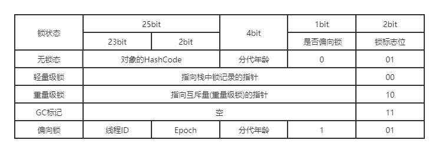

# JVM

# 基本结构

* 类加载子系统:负责从文件系统或网络中加载class信息,加载的信息存放在方法区的内存空间中.除了类的信息外,方法区中可能还会存放运行时常量池信息,包括字符串字面量和数组常量
* 方法区:存放类编译后代码,被所有线程共享.包括常量,常量池,静态变量,类信息
* 元空间:存放类元数据,而永久代是方法区的实现
  * JDK8后,永久代被取消,存储于永久代的信息全部存入到本地内存中
  * 元空间不属于JVM,是直接使用内存
* Java堆:虚拟机启动的时候建立,存放几乎所有的对象实例,并且所有线程共享堆空间
  * 在JDK8之前,堆中有新生代,老年代和永久代,永久代主要存放常量池等不变的信息
  * JDK8后,还将存储常量,常量池信息,包括字符串字面量和数字常量
* 直接内存:java的nio库允许使用直接内存来提高性能,直接内存优于堆,读写频繁场合可能会使用
  * 直接内存不属于java堆空间,大小不受Xmx控制,理论可无限大,但仍然受系统内存限制
* Java栈:每个虚拟机线程都有一个私有栈,在线程被创建的时候创建.栈中保存帧信息,局部变量,方法参数,java方法调用,返回值等.栈不存在垃圾回收问题,只要线程结束,资源就释放
* 本地方法栈:和java栈类似,但虚拟机允许java直接调用native本地方法(通常用C编写)
* 垃圾回收:回收方法区,堆,直接内存的空间,其中java堆是垃圾回收的重点区域.
* PC寄存器:每个线程私有,并且每个线程都会创建.
  * 任意时刻,java线程总是在执行一个方法,该方法称为当前方法
  * 若当前方法不是本地方法,则pc寄存器会执行当前方法的指令
  * 若是native方法,pc寄存器值为undefined
  * 寄存器存放当前执行环境指针,程序计算器,操作栈指针,计算的变量指针等
* 程序计数器:每个线程都有,就是一个指针,指向方法区中的下一个要执行的代码指令,由执行引擎读取,占用非常小,几乎可以忽略不记
* 执行引擎:执行虚拟机的字节码
* 本地接口库:JDK中以native修饰的方法或类,主要是用来调用C语言或本地的系统方法,逐渐在减少使用

# 联系

* 堆解决的是数据存储问题,即数据怎么放,放在哪
* 栈解决程序的运行问题,即程序如何执行,或者说如何处理数据
* 方法区则是辅助堆栈的一块永久区(Perm),解决堆栈信息的产生,是先决条件
  * 如:创建一个User对象,那么User类的一些信息(类信息,静态信息都存在于方法区中)
  * User被实例化之后,被存储到java堆中,一块内存空间
  * 使用实例的是时候,都是使用User对象的引用,如User user = new User(),user则放在栈中

# 对象

## 对象结构

* Header:对象头,存储对象的源数据
  * 自身运行时数据:哈希值,GC分代年龄,锁动态标志,线程持有的锁,偏向线程ID,偏向时间戳
  * 类型指针:对象指向类的源数据指针,虚拟机通过该值确实对象是那个类的实例
* InstanceData:实例数据
* Padding:无实际意义,主要用来填充以达到字节数为8的倍数

## 对象创建

* new 类名
* 根据new的参数在常量池中定义一个类的符号引用
* 如果没有找到这个符号引用,说明类还没有被加载,则进行类加载,解析和初始化
* 虚拟机在堆中为对象分配内存
* 将分配的内存吃实话为零值,不包含对象头
* 调用对象的初始化方法

# Java堆

* 是和java应用程序关系最密切的内存空间,几乎所有的对象都存放在其中,并且java堆完全是自动化管理,通过垃圾回收机制,垃圾对象会自动清理,不需要显示释放

* 根据垃圾回收机制不同,java堆有可能拥有不同的结构,最为常见的就是将整个java堆分为新生代和老年代,其中新生代存放新生的对象或者年龄不大的对象,老年代则存放老年对象
* 新生代分为eden区,s0区,s1区,s0和s1也被称为from和to区域,他们是两块大小相等并且可以互换角色的空间
* 绝大多数情况下,对象首先分配在eden区,在一次新生代回收后,如果对象还存活,则会进入s0或s1区,之后每经过一次新生代回收,如果对象存活则它的年龄就加1,当对象达到一定的年龄后,则进入老年代
* 一般在初始化时将堆内存的最大和最小内存设置相同,可以减少GC回收次数

# Java栈

* 线程独占,是一块线程私有的内存空间,一般由以下几个组成部分
  * 局部变量表:用于保存函数的参数,局部变量,基本数据类型,引用类型,返回类型.局部变量表的内存空间是在编译期完成分配,在方法运行时不会改变局部变量表的大小
  * 操作数栈:主要保存计算过程的中间结果,同时作为计算过程中变量临时的存储空间
  * 帧数据区:除了局部变量表和操作数栈以外,栈还需要一些数据来支持常量池的解析,这里帧数据区保存着访问常量池的指针,方便程序访问常量池,另外,当函数返回或者出现异常时,虚拟机必须有一个异常处理表,方便发送异常的时候找到异常的代码,因此异常处理表也是帧数据区的一部分
  * 本地变量:输入和输出参数以及方法内变量
  * 栈操作:记录入栈,出栈的操作
  * 栈帧数据:包括类文件,方法等
* 栈中的数据都是以栈帧(Stack Frame)的格式存在,栈帧是一个内存区块,是一个数据集,是一个有关方法和运行期数据的数据集,当一个方法A被调用时就产生了一个栈帧F1,并被压入栈中,A调用B,也是产生了F2,也被压入栈,执行完毕后,先弹出F2,再弹出F1,遵循先进后出的原则

# 方法区

* 方法区和堆一样,方法区是一块所有线程共享的内存区域,它保存系统的类信息,比如类的字段,方法,常量池等.方法区的发小决定了系统可以保存多少个类,如果系统定义太多的类,导致方法区溢出,虚拟机同样会抛出内存溢出的错误,方法区可以理解为永久区

# GC算法

## 复制算法

核心思想就是将内存空间分为两块,每次只使用其中一块,在垃圾回收时,将正在使用的内存中的存留对象复制到未被使用的内存块中,之后去清除之前正在使用内存块中所有的对象,反复去交换两个内存的角色,完成垃圾收集

## 引用计数法

这是个比较古老而经典的垃圾收集算法,核心就是在对象被其他对象引用时计数器加1,而当引用失效时则减1,但是这种方法有非常严重的问题:无法处理循环引用的情况,而且每次进行加减操作比较浪费系统性能

## 标记清除法

就是分为标记和清除两个阶段进行处理量内存中的对象,当然这种方式也有非常大的弊端,就是空间碎片问题,垃圾回收后的空间不是连续的,不连续的内存空间的工作效率要低于连续的内存空间

## 标记压缩法

标记压缩法在标记清除法基础上做了优化,把存活的对象压缩到内存一端,而后进行垃圾清理.java中老年代就是使用的标记压缩法

## 分代算法

根据对象的特点把内存分为N块,而后根据每个内存的特点使用不同的算法

对于新生代和老年代来说,新生代回收的频率更高,但是每次回收耗时都很短,而老年代回收频率较低,但是耗时比较长,所以应该尽量减少老年代的GC

## 分区算法

将整个内存分为N多个小的独立空间,每个小空间都恶意独立使用,这样细粒度的控制一次回收多少个小空间的那些个小空间,而不是对整个空间进行GC,从而提升性能,并减少GC的停顿时间

## GC停顿

垃圾回收器的任务是识别和回收垃圾对象进行内存清理,为了让垃圾回收器可以高效的执行,大部分情况下,会要求系统进入一个停顿的状态.停顿的目的是终止所有应用线程,只有这样系统才不会有新的垃圾产生,同时停顿保证了系统状态在某一个瞬间的一致性,也有益于更好的标记垃圾对象,因此在垃圾会后时,都会产生应用停顿的现象

# GC种类

## 串行回收器

* 使用单线程进行垃圾回收.每次回收时,串行回收器只有一个工作线程,对于并行能力较弱的计算机来说,串行回收器的专注性和独占性往往有更好的性能表现.串行回收器可以在新生代和老年代使用.
* -XX:+UseSerialGC:可以设置新生代串行回收器和老年代回收器

## 并行回收器

* 可以使用多线程同时进行垃圾回收
* ParNew回收器是一个工作在新生代的垃圾回收器,他只是简单的将串行回收器多线程化,它的回收策略和算法和串行回收器一样
* -XX:+UseParNewGC新生代回收器,老年代则使用串行回收器
* -XX:ParallelGCThreads:指定ParNew的回收器线程数,一般最好和CPU核心数相当

## CMS回收器

* ConcurrentMarkSweep,并发标记清除,使用的是标记清除法,主要关注系统停顿时间
* -XX:+UseConcMarkSweepGC:设置是否使用该回收器
* -XX:ConcGCThreads:设置并发线程数
* CMS并不是独占的回收器,也就是说CMS回收的过程中,应用程序仍然在不停的工作,又会有新的垃圾不断产生,所以在使用CMS的过程中应该确保应用程序的内存足够.CMS不会等到应用程序饱和的时候采取回收垃圾,而是在某一个阀值的时候开始回收.如果内存使用率增长的很快,在CMS执行过程中已经出现了内存不足的情况,此时回收就会失败,虚拟机将启动老年代串行回收器进行垃圾回收,这会导致应用程序中断,直到垃圾回收完成后才会正常工作.这个过程GC停顿时间可能较长
* -XX:CMSInitiatingOccupancyFraction:指定回收阀值,默认是68,也就是说当老年代的空间使用率达到68%的时候,会执行CMS回收
* -XX:+UseCMSCompactAtFullCollection:使用CMS回收器之后,是否进行随便整理
* -XX:CMSFullGCsBeforeCompaction:设置进行多少次CMS回收之后对内存进行一次压缩

## G1回收器

* Garbage First,在jdk1.7中提出的垃圾回收器,从长期来看是为了取代CMS回收器,G1回收器拥有独特的垃圾回收策略,G1属于分代垃圾回收器,区分新生代和老年代,依然有eden和from/to区,它不要求整个eden或新生代,老年代的空间都连续,它使用了分区算法
* 并行性:G1回收期间可多线程同时工作
* 并发性:G1拥有与应用程序交替执行能力,部分工作可与应用程序同时执行,在整个GC期间不会完全阻塞应用
* 分代GC:G1依然是一个分代收集器,但是它是兼顾新生代和老年代一起工作,之前的垃圾收集器在新生代,或老年代工作,这是一个很大的不同
* 空间整理:G1在回收过程中,不会像CMS那样在若干次GC后需要进行碎片整理,G1采用了有效复制对象的方式,减少空间碎片
* 可预见性:由于分区的原因,G1可以只选取部分区域进行回收,缩小了回收的范围,提升性能
* 分区回收,优先回收话费时间少,垃圾比例高的区域
* -XX:+UseG1GC:是否使用G1回收器
* -XX:MaxGCPauseMillis:指定最大停顿时间,默认是200ms
* -XX:ParallelGCThreads:设置并行回收的线程数量
* -XX:G1HeapRegionSize:1,2,4,8,16,32,只有这几个值,单位是M.region有多大,该代码是在headpregion.cpp中

## 次收集(Scavenge)

* 新生代GC(Scavenge GC):指发生在新生代的GC,因为新生代的java对象大多数都是朝生夕死的,所以ScavengeGC比较频繁,一般回收速度也比较快.当eden空间不足时,会触发ScavengeGC
* 一般情况下,当新对象生成,并且在eden申请空间失败时,就会触发ScavengeGC,对eden区域进行GC,清除非存活对象,并且把尚且存活的对象移动到Survivor(新生代的from和to)区.然后整理survivor的两个区.这种方式的GC是对年轻代的eden区进行,不会影响到老年代.

## 全收集

* 老年代(FullGC):发生在老年代的GC,出现了FullGC一般会伴随着至少一次的ScavengeGC.FullGC的速度一般会比ScavengeGC慢10倍以上.当老年代内存不足或显示调用system.gc()方式时,会触发FullGC

# Jvm参数配置

* -Xms:设置java启动初始堆大小,包括新生和老年代 
* -Xmx:设置java能获得的最大堆大小.如-Xmx2048M
* -Xmn:设置新生代大小,一般会设置为整个堆空间的1/3或1/4
* -Xss:指定线程的最大栈空间大小
* -XX:NewSize=n:设置新生代大小
* -XX:SurvivorRatio=n: 设置新生代中eden和from/to空间比例,如2,表示eden/form=eden/to=2
* -XX:MaxPermSize=n:设置老年代大小,默认是64M
* -XX:NewRatio=n:设置新生代和老年代的比值,如为3,表示年轻代:老年代为1:3
* -XX:+UseSeialGC:配置年轻代为串行回收器
* -XX:+UseParallelGC:设置年轻代为并行收集器
* -XX:+UseParalledlOldGC:设置老年代并行收集器
* -XX:+UseConcMarkSweepGC:设置并发收集器
* -XX:+PrintGC:当虚拟机启动后,只要遇到GC就会打印日志
* -XX:+PrintGCDetails:可以查看详细信息,包括各个区的情况
*  -XX:+PrintGCTimeStamps -Xloggc:filename
* -XX:+HeapDumpOnOutOfMemoryError:使用该参数可以在OOM时导出整个堆信息
* -XX:HeapDumpPath:设置OOM时导出的信息存放地址
* -XX:MaxTenuringThreshold:默认15,指经多少次垃圾回收,垃圾从新生代进入老年代
* -XX:MaxGCPauseMillis:设置最大垃圾手气停顿时间,可用把虚拟机在GC停顿的时间控制在MaxGCPauseMillis范围内,如果希望减少GC停顿时间可以将MaxGCPauseMillis设置的很小,但是会导致GC频繁,从而增加了GC的总时间降低了吞吐量,所以需要根据实际情况设置
* -XX:GCTimeRatio:设置吞吐量大小,它是一个0到100之间的整数,默认情况下是99,那么系统将花费不超过1/(1+n)的时间用于垃圾回收,也就是1/(1+99)=1%的时间
* -XX:UseAdaptiveSizePolicy:自适应模式,在这种情况下,新生代的大小,eden,from/to的比例,以及晋升老年代的对象年龄参数会被自动调整,已达到在堆大小,吞吐量和停顿时间之间的平衡