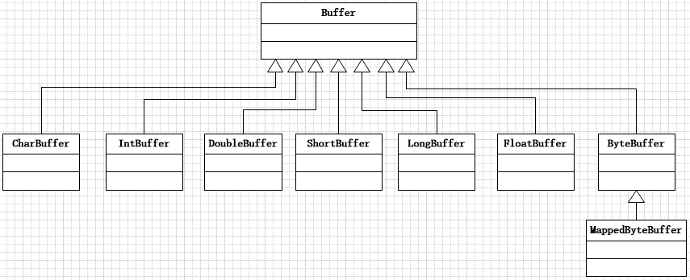
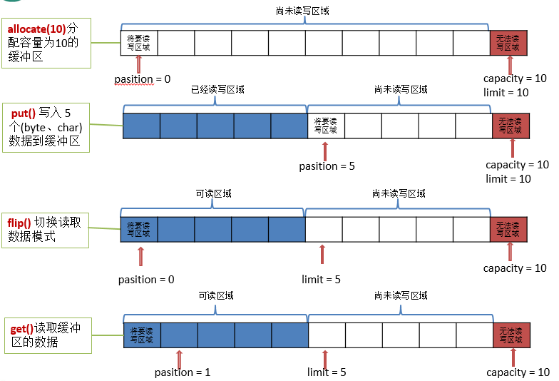
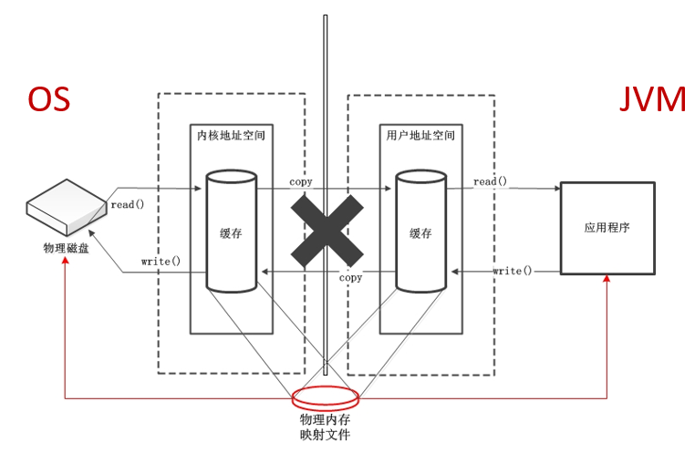

# NIO


# 概述

* Java NIO(Non-Blocking IO)可以替代标准的Java IO API,NIO与原来的IO有同样的作用和目的,但是使用的方式完全不同,NIO支持面向缓冲区的,基于通道的IO操作
* NIO将以更加高效的方式进行文件的读写操作


# URI,URL,URN

URI:uniform resource identifier,统一资源标识符,用来唯一的标识一个资源.

URL:uniform resource locator,统一资源定位符,它是一种具体的URI,即URL可以用来标识一个资源,而且还指明了如何locate这个资源.

URN:uniform resource name,统一资源命名,是通过名字来标识资源,比如mailto:java-net@java.sun.com.

URI是以一种抽象的,高层次概念定义统一资源标识,而URL和URN则是具体的资源标识的方式.URL和URN都是一种URI.

在Java的URI中,一个URI实例可以代表绝对的,也可以是相对的,只要它符合URI的语法规则.而URL类则不仅符合语义,还包含了定位该资源的信息,因此它不能是相对的.


# Path

早期Java只提供了一个File类来访问文件系统,但File类的功能比较有限,所提供的方法性能也不高.而且,大多数方法在出错时仅返回失败,并不会提供异常信息.

NIO为了弥补这种不足,引入了Path接口,代表一个平台无关的平台路径,描述了目录结构中文件的位置.

Path可以看成是File类的升级版本,实际引用的资源也可以不存在.

NIO还提供了Files,Paths工具类,Files包含了大量静态的工具方法来操作文件;Paths则包含了两个返回Path的静态工厂方法.

Paths类提供的静态get()用来获取Path对象:

```java
// 用于将多个字符串串连成路径
static Path get(String first, String … more);
// 返回指定uri对应的Path路径
static Path get(URI uri);
```

Path 常用方法:

* toString():返回调用 Path 对象的字符串表示形式
* startsWith(String path):判断是否以 path 路径开始
* endsWith(String path):判断是否以 path 路径结束
* isAbsolute():判断是否是绝对路径
* getParent():返回Path对象包含整个路径,不包含 Path 对象指定的文件路径
* getRoot():返回调用 Path 对象的根路径
* getFileName():返回与调用 Path 对象关联的文件名
* getName(int idx):返回指定索引位置 idx 的路径名称
* getNameCount():返回Path 根目录后面元素的数量
* toAbsolutePath():作为绝对路径返回调用 Path 对象
* resolve(Path p):合并两个路径,返回合并后的路径对应的Path对象
* toFile():将Path转化为File类的对象


# Files

Files用于操作文件或目录的工具类.

Files常用方法:

* copy(Path src, Path dest, CopyOption … how):文件的复制
* createDirectory(Path path, FileAttribute<?> … attr):创建一个目录
* createFile(Path path, FileAttribute<?> … arr):创建一个文件
* delete(Path path):删除一个文件,如果不存在,执行报错
* deleteIfExists(Path path):Path对应的文件如果存在,执行删除
* move(Path src, Path dest, CopyOption…how):将 src 移动到 dest 位置
* size(Path path):返回 path 指定文件的大小
* exists(Path path, LinkOption … opts):判断文件是否存在
* isDirectory(Path path, LinkOption … opts):判断是否是目录
* isRegularFile(Path path, LinkOption … opts):判断是否是文件
* isHidden(Path path):判断是否是隐藏文件
* isReadable(Path path):判断文件是否可读
* isWritable(Path path):判断文件是否可写
* notExists(Path path, LinkOption … opts):判断文件是否不存在
* newByteChannel(Path path, OpenOption…how):获取与指定文件的连接,how 指定打开方式
* newDirectoryStream(Path path):打开 path 指定的目录
* newInputStream(Path path, OpenOption…how):获取 InputStream 对象
* newOutputStream(Path path, OpenOption…how):获取 OutputStream 对象


# 缓冲区(Buffer)

BIO:面向流(Stream  Oriented),单向的阻塞IO

NIO:面向缓冲区(Buffer  Oriented),通道是单向的,也可以是双向的,非阻塞IO,使用选择器(Selectors)

一个Channel类可能实现定义read()的ReadableByteChannel接口,而另一个Channel类也许实现WritableByteChannel接口以提供write().

实现这两种接口其中之一的类都是单向的,只能在一个方向上传输数据.如果一个类同时实现这两个接口,那么它是双向的,可以双向传输数据,比如:ByteChannel.

NIO系统的核心在于:通道(Channel)和缓冲区(Buffer).通道表示IO源打开到 IO 设备(例如:文件、套接字)的连接.若需要使用 NIO 系统,需要获取用于连接 IO 设备的通道以及用于容纳数据的缓冲区.然后操作缓冲区,对数据进行处理.

**Channel负责传输,Buffer负责存储数据.**

Buffer 就像一个数组,可以保存多个相同类型的数据.根据数据类型不同(boolean除外),有以下 Buffer 常用子类:



上述 Buffer 类都采用相似的方法进行管理数据,只是各自管理的数据类型不同而已.都是通过各自类的如下方法获取一个 Buffer 对象:

static XxxBuffer allocate(int capacity):创建一个容量为 capacity 的 XxxBuffer 对象


## 基本属性

**容量(capacity):**表示 Buffer 最大数据容量,一旦声明后,不能更改.通过Buffer中的capacity()获取.缓冲区capacity不能为负.

**限制(limit):**第一个不应该读取或写入的数据的索引,即位于 limit 后的数据不可读写.通过Buffer中的limit()获取.缓冲区的limit不能为负,并且不能大于其capacity.

**位置(position):**当前要读取或写入数据的索引.通过Buffer中的position()获取.缓冲区的position不能为负,并且不能大于其limit.

**标记(mark):**标记是一个索引,通过 Buffer 中的 mark() 方法将mark标记为当前position位置. 之后可以通过调用 reset() 方法将 position恢复到标记的mark处.

**标记、位置、限制、容量遵守以下不变式:0 <= mark <= position <= limit <= capacity** 


## 基本操作

Buffer 所有子类提供了两个用于数据操作的方法:put() 与 get()

以ByteBuffer类为例,放入数据到Buffer中

* put(byte b):将给定单个字节写入缓冲区的当前位置
* put(byte[] src):将 src 中的字节写入缓冲区的当前位置
* put(int index, byte b):将指定字节写入缓冲区的索引位置(不会移动 position)

获取Buffer中的数据

* get():读取单个字节
* get(byte[] dst):批量读取多个字节到 dst 中
* get(int index):读取指定索引位置的字节(不会移动 position)




## 常用方法

 flip():将limit设置为当前position,将position设置为0,mark设置为-1

rewind():将position设为为0,mark设为-1.可重复读

clear():将limit设为capacity,将position设为0,并将mark设为-1.数据没有清空

mark():对缓冲区设置mark

reset():将位置position转到以前设置的mark所在的位置

hasRemaining():判断缓冲区中是否还有元素

remaining():返回position和limit之间的元素个数

array():返回XxxBuffer底层的Xxx数组

capacity():返回Buffer 的capacity大小

limit():返回Buffer的界限(limit)的位置

limit(int n):将设置缓冲区界限为n,并返回一个具有新 limit 的缓冲区对象

position():返回缓冲区的当前位置position

position(int n):将设置缓冲区的当前位置为n,并返回修改后的 Buffer  对象


## 直接和非直接缓冲区

**字节缓冲区要么是直接的,要么是非直接的.****如果为直接字节缓冲区,则** **Java** **虚拟机会尽最大努力直接在此缓冲区上执行本机** **I/O** **操作.也就是说,在每次调用基础操作系统的一个本机** **I/O** **操作之前（或之后）,虚拟机都会尽量避免将缓冲区的内容复制到中间缓冲区中（或从中间缓冲区中复制内容）.**

**直接字节缓冲区可以通过****调用****ByteBuffer****的** **allocateDirect****()** **工厂方法****来创建.此方法返回的****缓冲区进行分配和取消分配所需成本通常高于非直接缓冲区.****直接缓冲区的内容可以驻留在常规的垃圾回收堆之外,因此,它们对应用程序的内存需求量造成的影响可能并不明显.所以,建议将直接缓冲区主要分配给那些易受基础系统的本机** **I/O** **操作影响的大型、持久的缓冲区.一般情况下,****最好仅在直接缓冲区能在程序性能方面带来明显好处时分配它们.** 

**直接字节缓冲区还可以****通过** **FileChannel** **的** **map()** **方法** **将文件区域直接映射到内存中来创建****.该方法返回****ByteBuffer****的子类:****MappedByteBuffer** **.****Java** **平台的实现有助于通过** **JNI** **从本机代码创建直接字节缓冲区.如果以上这些缓冲区中的某个缓冲区实例指的是不可访问的内存区域,则试图访问该区域不会更改该缓冲区的内容,并且将会在访问期间或稍后的某个时间导致抛出不确定的异常.**

**字节缓冲区是直接缓冲区还是非直接缓冲区可通过调用其** **isDirect****()** **方法来确定.提供此方法是为了能够在性能关键型代码中执行显式缓冲区管理****.**


### 非直接缓冲区


### 直接缓冲区




# 通道(Channel)

通道 (Channel):由 java.nio.channels 包定义的

Channel 表示 IO 源与目标节点打开的连接.

Channel 类似于传统的“流”.只不过 Channel 本身不能直接存储数据,Channel 只能与 Buffer 进行交互.


DMA(Direct Memory Access,直接内存存取器)


专用IO


**Java** **为** **Channel** **接口提供的最主要实现类如下:**

* **FileChannel**:用于读取、写入、映射和操作文件的通道
* **SocketChannel**:通过 TCP 读写网络中的数据 
* **ServerSocketChannel**:可以监听新进来的 TCP 连接,对每一个新进来的连接都会创建一个SocketChannel
* **DatagramChannel**:通过 UDP 读写网络中的数据通道


获取通道的一种方式:对支持通道的对象调用 getChannel() 方法.支持通道的类如下:

* FileInputStream
* FileOutputStream
* RandomAccessFile
* Socket
* ServerSocket
* DatagramSocket

获取通道的其他方式:

* 通过XxxChannel的静态方法 open() 打开并返回指定的XxxChannel.
* 使用 Files 工具类的静态方法 newByteChannel() 获取字节通道

虽然FileChannel既可以读取、也可以写入,但FileInputStream获取的FileChannel只能读,FileOutputStream获取的FileChannel只能写.RandomAccessFile获取的FileChannel是只读的还是读写的Channel,取决于RandomAccessFile打开文件的模式.


# 文件通道(FileChannel)

常用方法

| **方   法**                                                  | **描   述**                                                  |
| ------------------------------------------------------------ | ------------------------------------------------------------ |
| **int** **read(****ByteBuffer** **dst****)**                 | **从** **Channel** **中读取数据到** **ByteBuffer**           |
| **long** **read(****ByteBuffer****[]** **dsts****)**         | **将** **Channel** **中的数据“分散”到** **ByteBuffer[]**     |
| **int** **write(****ByteBuffer** **src****)**                | **将** **ByteBuffer** **中的数据写入到** **Channel**         |
| **long write(****ByteBuffer****[]** **srcs****)**            | **将** **ByteBuffer****[]** **中的数据“聚集”到** **Channel** |
| **MappedByteBuffer map(MapMode** **mode,long position,long size)** | **将****Channel****对应的部分或全部数据映射到****ByteBuffer** |
| long  position()                                             | 返回此通道的文件位置                                         |
| FileChannel  position(long p)                                | 设置此通道的文件位置                                         |
| long size()                                                  | 返回此通道的文件的当前大小                                   |
| FileChannel  truncate(long s)                                | 将此通道的文件截取为给定大小                                 |
| void  force(boolean metaData)                                | 强制将所有对此通道的文件更新写入到存储设备中                 |

从 Channel 读取数据到 Buffer,将Buffer中数据写入Channel

```java
// 从Channel读取数据到Buffer中
int bytes = channel.read(buf);
// 将Buffer中数据写入Channel中
int bytes = channel.write(buf);
```


**分散****(****Scatter)****读取****和****聚集****(Gather****)****写入**


l分散读取（Scattering Reads）是指从 Channel 中读取的数据“分散”到多个 Buffer 中.按照缓冲区的顺序,从 Channel 中读取的数据依次将 Buffer 填满

l聚集写入（Gathering Writes）是指将多个 Buffer 中的数据“聚集”到 Channel.按照缓冲区的顺序,写入 position 和 limit 之间的数据到 Channel 


**阻塞式与非阻塞式**

l传统的 IO 流都是阻塞式的.也就是说,当一个线程调用 read() 或 write() 时,该线程被阻塞,直到有一些数据被读取或写入.该线程在此期间不能执行其他任务.因此,在完成网络通信进行 IO 操作时,由于线程会阻塞,所以服务器端必须为每个客户端都提供一个独立的线程进行处理,当服务器端需要处理大量客户端时,性能急剧下降.

lJava NIO 是非阻塞模式的.当线程从某通道进行读写数据时,若没有数据可用时,该线程可以进行其他任务.线程通常将非阻塞 IO 的空闲时间用于在其他通道上执行 IO 操作,所以单独的线程可以管理多个输入和输出通道.因此,NIO 可以让服务器端使用一个或有限几个线程来同时处理连接到服务器端的所有客户端.


**选择器** **(Selector)**

l选择器(Selector) 是 SelectableChannel 对象的多路复用器,Selector 可以同时监控多个 SelectableChannel 的 IO 状况,也就是说,利用 Selector 可使一个单独的线程管理多个 Channel.Selector 是非阻塞 IO 的核心.

lSelectableChannel 的结构如下图:


**SocketChannel**

lJava NIO中的SocketChannel是一个连接到TCP网络套接字的通道.

l操作步骤:

Ø打开 SocketChannel

Ø读写数据

Ø关闭 SocketChannel


```java
SocketChannel socketChannel = SocketChannel.open(
new InetSocketAddress(InetAddress.getByName("127.0.0.1"), 9090));
// 切换非阻塞模式
socketChannel.configureBlocking(false);
// 向Selector注册Channel
socketChannel.register(selector, SelectionKey.OP_READ);
```


lJava NIO中的 ServerSocketChannel 是一个可以监听新进来的TCP连接的通道,就像标准IO中的ServerSocket一样.

```java
ServerSocketChannel serverSocketChannel = ServerSocketChannel.open();
serverSocketChannel.bind(new InetSocketAddress(9090));
SocketChannel socketChannel = serverSocketChannel.accept();
// 切换非阻塞模式
serverSocketChannel.configureBlocking(false);
serverSocketChannel.bind(new InetSocketAddress(9898));
serverSocketChannel.register(selector, SelectionKey.OP_ACCEPT);
socketChannel.configureBlocking(false);
```


**DatagramChannel**

lJava NIO中的DatagramChannel是一个能收发UDP包的通道.

l操作步骤:

Ø打开 DatagramChannel

Ø接收/发送数据


**选择****器****(Selector****)****的应用**

l创建 Selector :通过调用 Selector.open() 方法创建一个 Selector.l向选择器注册通道:SelectableChannel.register(Selector sel, int ops)

```java
Selector.open()= Selector.open();
ServerSocketChannel serverChannel = ServerSocketChannel.open();
serverChannel.register(selector, SelectionKey.OP_ACCEPT);
```

| **方   法**               | **描   述**                                                  |
| ------------------------- | ------------------------------------------------------------ |
| int select()              | 监控所有注册的Channel,当它们中间有需要处理的 IO 操作时,该方法返回,并将对应得的 SelectionKey 加入被选择的 SelectionKey 集合中,该方法返回这些 Channel 的数量. |
| selectedKeys()            | 被选择的 SelectionKey 集合.返回此Selector的已选择键集        |
| Set<SelectionKey>  keys() | 所有的 SelectionKey 集合.代表注册在该Selector上的Channel     |
| int select(long timeout)  | 可以设置超时时长的  select() 操作                            |
| int  selectNow()          | 执行一个立即返回的  select() 操作,该方法不会阻塞线程         |
| Selector  wakeup()        | 使一个还未返回的  select() 方法立即返回                      |
| void close()              | 关闭该选择器                                                 |


**选择键****(****SelectionKey****)**

l当调用 **register(Selector** **sel****,** **int** **ops)** 将通道注册选择器时,选择器对通道的监听事件,需要通过第二个参数 ops 指定.

l可以监听的事件类型（**可使用** **SelectionKey** **的四个常量****表示**）:

Ø读 : SelectionKey.OP_READ （1）

Ø写 : SelectionKey.OP_WRITE  （4）

Ø连接 : SelectionKey.OP_CONNECT （8）

Ø接收 : SelectionKey.OP_ACCEPT （16）

 若注册时不止监听一个事件,则可以使用位或(|)操作符连接

lSelectionKey:表示 SelectableChannel 和 Selector 之间的注册关系.每次向Selector注册Channel时就会选择一个事件(选择键).选择键包含两个表示为整数值的操作集.操作集的每一位都表示该键的通道所支持的一类可选择操作.

| **方   法**                 | **描   述**                      |
| --------------------------- | -------------------------------- |
| boolean isAcceptable()      | 检测 Channel  中接收是否就绪     |
| boolean isReadable()        | 检测 Channal  中读事件是否就绪   |
| boolean isWritable()        | 检测  Channal  中写事件是否就绪  |
| SelectableChannel channel() | 获取注册通道                     |
| int   interestOps()         | 获取感兴趣事件集合               |
| int  readyOps()             | 获取通道已经准备就绪的操作的集合 |
| Selector selector()         | 返回选择器                       |
| boolean  isConnectable()    | 检测  Channel  中连接是否就绪    |


管道(Pipe)

lJava NIO 管道是2个线程之间的单向数据连接.Pipe有一个source通道和一个sink通道.数据会被写到sink通道,从source通道读取.

代码见dream-study-java-io/com/wy/nio/S_Pipe.java